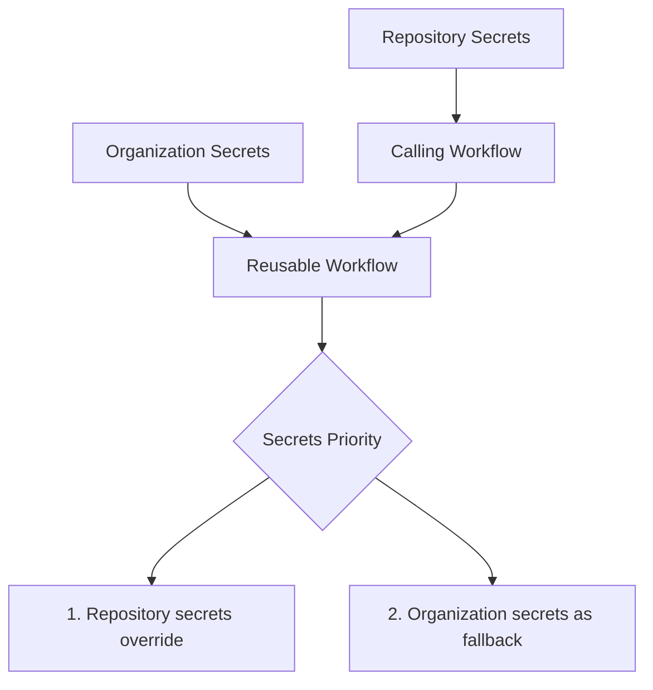

# Cloudflare Pages Deployment Template

**For:** React, Vue, Svelte, or any Vite-based applications  
**Quick Start:** See [QUICK_START_README.md](./QUICK_START_README.md) or [CHEAT_SHEET.md](./CHEAT_SHEET.md)

---

## 🎯 **What This Template Does**

✅ **Automated deployments** on branch pushes  
✅ **Creates Cloudflare Pages projects** automatically if they don't exist  
✅ **Configures custom domains** with error handling  
✅ **Multi-environment support** (dev, staging, production)  
✅ **Smart secret management** (organization secrets with optional overrides)  
✅ **Package manager flexibility** (npm, yarn, pnpm)  
✅ **Comprehensive logging** and error handling  

## � **Simplest Setup**

1. **Ask DevOps** to set organization secrets (one-time):
   - `CLOUDFLARE_API_TOKEN`
   - `CLOUDFLARE_ACCOUNT_ID`

2. **Copy template** to your project: `.github/workflows/deploy.yml`

3. **Change two things:**
   - `project-name: YOUR_APP_NAME` 
   - `build-directory: dist` (Vite) or `build-directory: build` (CRA)

4. **Push and deploy!** 🎉

---

### 1. Organization Secrets (Recommended)

Set up **Organization secrets** for default Cloudflare account:

**GitHub Organization Settings → Secrets and variables → Actions:**
```
CLOUDFLARE_API_TOKEN     # API token with Pages:Edit permissions
CLOUDFLARE_ACCOUNT_ID    # Your Cloudflare account ID  
```

**Benefits:**
- ✅ **Automatic inheritance** - Available to all repositories
- ✅ **Zero setup** for new projects
- ✅ **Centralized management** - Update once, applies everywhere
- ✅ **Flexible overrides** - Projects can use different accounts when needed

### 2. Basic Workflow (Uses Organization Secrets)

Create `.github/workflows/deploy.yml` in your project repository:

```yaml
name: Deploy to Cloudflare Pages

on:
  push:
    branches: [development, main]

jobs:
  # Uses organization secrets automatically
  deploy-dev:
    if: github.ref == 'refs/heads/development'
    uses: simplify9/.github/.github/workflows/vite-ci.yml@main
    with:
      project-name: my-awesome-app
      environment: development
      project-name-suffix: -dev
      custom-domain: dev.yoursite.com

  # Override with different account if needed
  deploy-prod:
    if: github.ref == 'refs/heads/main'
    uses: simplify9/.github/.github/workflows/vite-ci.yml@main
    with:
      project-name: my-awesome-app
      environment: production
      custom-domain: yoursite.com
      fail-on-domain-error: true
    secrets:
      CLOUDFLARE_API_TOKEN: ${{ secrets.PROD_CLOUDFLARE_API_TOKEN }}
      CLOUDFLARE_ACCOUNT_ID: ${{ secrets.PROD_CLOUDFLARE_ACCOUNT_ID }}
```

## 🔐 **Secret Management Strategy**

### **How Secret Inheritance Works**



**Inheritance Order:**
1. ✅ **Repository secrets** (if explicitly passed) - Highest priority
2. ✅ **Organization secrets** (automatic inheritance) - Default fallback

### **Setup Options**

| Setup | Use Case | Complexity | Maintenance |
|-------|----------|------------|-------------|
| **Organization only** | Single Cloudflare account | 🟢 Simple | 🟢 Easy |
| **Mixed strategy** | Multiple accounts | 🟡 Medium | 🟡 Medium |
| **Repository only** | Per-project accounts | 🔴 Complex | 🔴 High |

**Recommended:** Start with organization secrets, add repository overrides as needed.

## ⚙️ Configuration Reference

### Workflow Inputs

| Parameter | Description | Default | Type |
|-----------|-------------|---------|------|
| `project-name` | **Base Cloudflare project name** | - | string (**required**) |
| `environment` | Deployment environment (dev/staging/prod) | `development` | string |
| `target-branch` | Git branch for Cloudflare project config | `development` | string |
| `node-version` | Node.js version | `18` | string |
| `package-manager` | Package manager (npm/yarn/pnpm) | `npm` | string |
| `build-command` | Build command to execute | `npm run build` | string |
| `build-directory` | Output directory after build | `build` | string |
| `project-name-suffix` | Suffix for Cloudflare project name | `''` | string |
| `custom-domain` | Custom domain to configure | `''` | string |
| `fail-on-domain-error` | Fail deployment if domain setup fails | `false` | boolean |
| `run-tests` | Execute tests before deployment | `true` | boolean |
| `test-command` | Test command to run | `npm test` | string |

### Workflow Outputs

| Output | Description |
|--------|-------------|
| `deployment-url` | URL of the deployed application |
| `project-name` | Full Cloudflare project name used |

## 🔧 Composite Actions

### setup-cloudflare-project

**Purpose**: Manages Cloudflare Pages project lifecycle

**Features**:
- ✅ Checks if project exists
- ✅ Creates project with proper configuration if missing
- ✅ Configures build settings
- ✅ Provides detailed status outputs

**Inputs**:
```yaml
api-token: ${{ secrets.CLOUDFLARE_API_TOKEN }}      # Required
account-id: ${{ secrets.CLOUDFLARE_ACCOUNT_ID }}    # Required  
project-name: my-app-dev                            # Required
production-branch: development                      # Optional
build-command: npm run build                        # Optional
destination-dir: build                              # Optional
root-dir: ''                                        # Optional
```

**Outputs**:
- `project-exists`: Whether project already existed
- `project-url`: URL of the project

### setup-cloudflare-domain

**Purpose**: Manages custom domain configuration

**Features**:
- ✅ Checks existing domain configuration
- ✅ Adds domains if not present
- ✅ Handles domain conflicts gracefully
- ✅ Optional failure modes

**Inputs**:
```yaml
api-token: ${{ secrets.CLOUDFLARE_API_TOKEN }}      # Required
account-id: ${{ secrets.CLOUDFLARE_ACCOUNT_ID }}    # Required
project-name: my-app-dev                            # Required
domain-name: dev.mysite.com                         # Required
fail-on-error: false                                # Optional
```

**Outputs**:
- `domain-added`: Whether domain was successfully added
- `domain-status`: Current status of domain configuration

## 💡 Usage Patterns

### Default Pattern (Organization Secrets)

```yaml
jobs:
  # Uses organization secrets - no secret management needed
  deploy-dev:
    if: github.ref == 'refs/heads/development'
    uses: simplify9/.github/.github/workflows/vite-ci.yml@main
    with:
      project-name: my-awesome-app
      environment: development
      project-name-suffix: -dev
      custom-domain: dev.myapp.com

  deploy-prod:
    if: github.ref == 'refs/heads/main'
    uses: simplify9/.github/.github/workflows/vite-ci.yml@main
    with:
      project-name: my-awesome-app
      environment: production
      custom-domain: myapp.com
      fail-on-domain-error: true
```

### Multi-Account Pattern (Override Secrets)

```yaml
jobs:
  # Development - uses organization account
  deploy-dev:
    if: github.ref == 'refs/heads/development'
    uses: simplify9/.github/.github/workflows/vite-ci.yml@main
    with:
      project-name: my-awesome-app
      environment: development
      project-name-suffix: -dev
      custom-domain: dev.myapp.com

  # Production - uses dedicated production account
  deploy-prod:
    if: github.ref == 'refs/heads/main'
    uses: simplify9/.github/.github/workflows/vite-ci.yml@main
    with:
      project-name: my-awesome-app
      environment: production
      custom-domain: myapp.com
      fail-on-domain-error: true
    secrets:
      CLOUDFLARE_API_TOKEN: ${{ secrets.PROD_CLOUDFLARE_API_TOKEN }}
      CLOUDFLARE_ACCOUNT_ID: ${{ secrets.PROD_CLOUDFLARE_ACCOUNT_ID }}
```
```

### Package Manager Variations

```yaml
# Using Yarn
deploy-with-yarn:
  uses: simplify9/.github/.github/workflows/vite-ci.yml@main
  with:
    project-name: my-app
    package-manager: yarn
    build-command: yarn build
    test-command: yarn test

# Using pnpm
deploy-with-pnpm:
  uses: simplify9/.github/.github/workflows/vite-ci.yml@main
  with:
    project-name: my-app
    package-manager: pnpm
    build-command: pnpm build
    test-command: pnpm test
```

### Custom Build Configurations

```yaml
# Custom build output directory
deploy-dist:
  uses: simplify9/.github/.github/workflows/vite-ci.yml@main
  with:
    project-name: my-app
    build-command: npm run build:prod
    build-directory: dist

# Skip tests for hotfixes
deploy-hotfix:
  uses: simplify9/.github/.github/workflows/vite-ci.yml@main
  with:
    project-name: my-app
    run-tests: false
    environment: hotfix
    project-name-suffix: -hotfix
```

## 🔍 Troubleshooting

### Common Issues

**Build directory not found**
```
❌ Build directory 'build' not found!
```
- **Solution**: Verify `build-directory` matches your Vite output (usually `dist` for Vite)
- **Fix**: Set `build-directory: dist` in workflow inputs

**Domain setup fails**
```
❌ Failed to add custom domain: Domain already exists
```
- **Solution**: Domain might be configured in another Cloudflare project
- **Fix**: Check Cloudflare dashboard or set `fail-on-domain-error: false`

**Project creation fails**
```
❌ Failed to create project: Quota exceeded
```
- **Solution**: You've reached the Cloudflare Pages project limit
- **Fix**: Delete unused projects or upgrade your Cloudflare plan

**API token permissions**
```
❌ Unauthorized: Invalid API token
```
- **Solution**: Your API token lacks necessary permissions
- **Fix**: Ensure token has `Zone:Zone Settings:Edit` and `Zone:Zone:Read` permissions

### Debug Mode

Enable detailed logging by checking the GitHub Actions logs. The template provides:

- ✅ Success indicators with checkmarks
- ❌ Error messages with details
- 📝 Informational messages
- 🔍 Status updates throughout the process

### Manual Verification

After deployment, verify:

1. **Project exists**: Check Cloudflare Pages dashboard
2. **Domain configured**: Visit custom domain URL
3. **Build output**: Verify files in Cloudflare Pages project
4. **Environment variables**: Check if custom env vars are set

## 🎯 Best Practices

### Secret Management
- ✅ **Organization secrets** for default Cloudflare account (recommended)
- ✅ **Repository-level overrides** for special accounts (production, client-specific)
- ✅ **Automatic inheritance** - no setup needed for standard deployments
- ✅ **Flexible account switching** - override secrets when different accounts are needed
- Rotate API tokens regularly in the organization settings

### Account Strategy
- **Default account**: Set organization secrets for development/staging
- **Production account**: Override with repository secrets for production-specific accounts
- **Client accounts**: Override with repository secrets for client-specific deployments
- Use descriptive secret names: `PROD_CLOUDFLARE_API_TOKEN`, `CLIENT_A_CLOUDFLARE_API_TOKEN`

### Project Naming
- Use descriptive, unique project names (e.g., `customer-portal`, `admin-dashboard`)
- Suffixes will be automatically added for environments (`-dev`, `-staging`)
- Avoid special characters except hyphens in project names

### Branch Strategy
- Use `development` branch for dev deployments
- Use `staging` branch for staging deployments  
- Use `main`/`master` branch for production deployments
- Set `fail-on-domain-error: true` for production environments

### Testing Strategy
- Always run tests in production deployments
- Consider running tests in staging as well
- Use `run-tests: false` only for hotfixes or emergency deployments

### Domain Management
- Use subdomains for non-production environments
- Set up proper DNS records before deployment
- Use `fail-on-domain-error: false` for dev environments for faster iteration

## 🚀 Advanced Usage

### Custom Environment Variables

```yaml
deploy-with-env:
  uses: simplify9/.github/.github/workflows/vite-ci.yml@main
  with:
    project-name: my-app
    environment: production
  env:
    VITE_API_URL: https://api.myapp.com
    VITE_APP_VERSION: ${{ github.sha }}
```

### Manual Deployment

```yaml
deploy-manual:
  if: github.event_name == 'workflow_dispatch'
  uses: simplify9/.github/.github/workflows/vite-ci.yml@main
  with:
    project-name: my-app
    environment: ${{ github.event.inputs.environment }}
    project-name-suffix: -${{ github.event.inputs.environment }}
```

### Integration with Other Actions

```yaml
deploy-with-notifications:
  uses: simplify9/.github/.github/workflows/vite-ci.yml@main
  with:
    project-name: my-app
    environment: production

notify-success:
  needs: deploy-with-notifications
  if: success()
  runs-on: ubuntu-latest
  steps:
    - name: Notify success
      run: |
        echo "Deployment successful: ${{ needs.deploy-with-notifications.outputs.deployment-url }}"
        # Add your notification logic here
```

## 📄 Migration from Manual Workflow

If you have an existing manual Cloudflare Pages deployment workflow, migration is straightforward:

1. **Identify your configuration**: Note your build command, output directory, and any custom domains
2. **No secrets setup needed**: The Cloudflare credentials are already centralized in the `.github` repository
3. **Replace workflow**: Replace your existing workflow with the template call, specifying your project name
4. **Test deployment**: Deploy to a development environment first

The template handles all the complex API calls and error scenarios that you previously managed manually.

## 🤝 Contributing

To contribute improvements to this template:

1. Fork the repository
2. Create a feature branch
3. Make your changes
4. Test with a real deployment
5. Submit a pull request

Focus areas for contribution:
- Additional package manager support
- Enhanced error handling
- Performance optimizations
- Documentation improvements