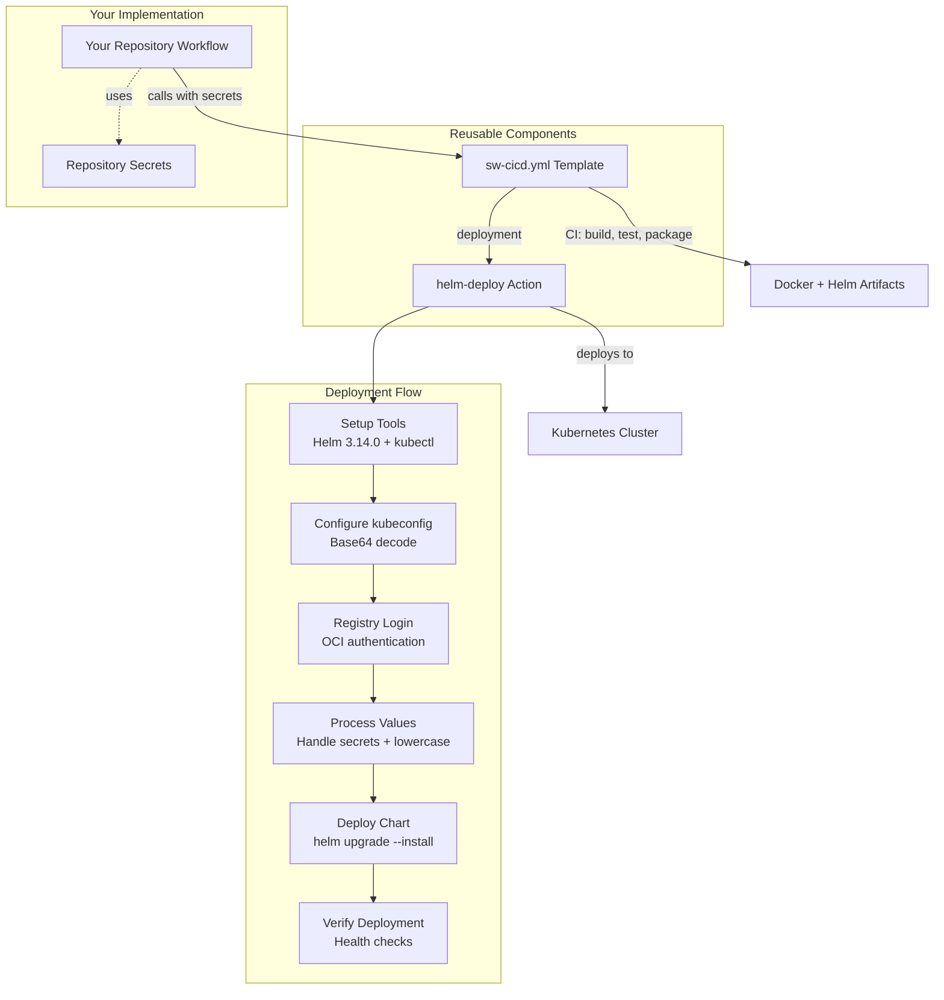

# Reusable CI/CD Workflows and Templates

This repository hosts reusable GitHub Actions workflows and composite actions for Simplify9 projects.

## 🚀 **Quick Start - Cloudflare Pages for Vite Apps**

**Most popular template!** Deploy React, Vue, Svelte, or any Vite app to Cloudflare Pages.

### **Complete Documentation**
👉 **[QUICK_START_README.md](./QUICK_START_README.md)** - Complete guide with copy-paste examples  
👉 **[CHEAT_SHEET.md](./CHEAT_SHEET.md)** - One-page reference for quick lookup

### **30-Second Setup:**
1. Check [QUICK_START_README.md](./QUICK_START_README.md) for copy-paste examples
2. Change `project-name` to your actual app name
3. Set `build-directory: dist` (for Vite) or `build-directory: build` (for CRA)
4. Push to `development` or `main` - done! 🎉

**What you get:**
- `development` branch → `your-app-dev` (auto-deployed)
- `main` branch → `your-app` (auto-deployed with tests)
- Automatic Cloudflare project creation
- Optional custom domain setup

---

## 📁 Repository Structure

```
.github/
├── actions/
│   ├── setup-cloudflare-project/    # Cloudflare Pages project setup
│   ├── setup-cloudflare-domain/     # Cloudflare custom domain configuration
│   └── helm-deploy/                 # Helm deployment action
└── workflows/
    ├── sw-cicd.yml                  # Complete .NET CI/CD pipeline
    ├── ci-docker.yaml              # Docker build and push
    ├── ci-helm.yaml                 # Helm chart deployment
    └── vite-ci.yml                  # Vite to Cloudflare Pages deployment
```

## 🚀 Available Templates

### 1. **next-ci.yml** - Next.js to Cloudflare Workers ⭐ Next.js 15 Compatible

Deploy Next.js applications with full SSR to Cloudflare Workers at the edge.

**Best for:** Next.js apps with SSR, API routes, dynamic content  
**Documentation:** [NEXTJS_DOCUMENTATION_INDEX.md](./NEXTJS_DOCUMENTATION_INDEX.md) | [NEXTJS_WORKERS_CI_USAGE.md](./NEXTJS_WORKERS_CI_USAGE.md)

**Key Features:**
- ✅ **Next.js 15 Compatible** with auto-detection
- ✅ Server-Side Rendering (SSR) at the edge
- ✅ API Routes & Dynamic Routes  
- ✅ **Smart worker script detection** (modern & legacy)
- ✅ **CI/CD friendly domain setup**
- ✅ Uses @cloudflare/next-on-pages
- ✅ Package manager flexibility (npm, yarn, pnpm)

```yaml
jobs:
  deploy:
    uses: simplify9/.github/.github/workflows/next-ci.yml@main
    with:
      environment: 'production'
      package-manager: 'yarn'
      install-command: 'yarn install --frozen-lockfile'
      auto-detect-worker-path: true  # Next.js 15 compatible
    secrets:
      CLOUDFLARE_API_TOKEN: ${{ secrets.CLOUDFLARE_API_TOKEN }}
      CLOUDFLARE_ACCOUNT_ID: ${{ secrets.CLOUDFLARE_ACCOUNT_ID }}
```

### 2. **vite-ci.yml** - Vite Apps to Cloudflare Pages ⭐

Deploy React, Vue, Svelte, and other Vite-based static applications to Cloudflare Pages.

**Best for:** Static React, Vue, Svelte, vanilla JS apps  
**Documentation:** [QUICK_START_README.md](./QUICK_START_README.md) | [CHEAT_SHEET.md](./CHEAT_SHEET.md)

### 4. **sw-cicd.yml** - Complete .NET CI/CD Pipeline

Reusable workflow name: `Reusable SW CI/CD Pipeline`

A production-ready CI/CD pipeline for .NET applications with Docker, Helm, and Kubernetes deployment.

**Features:**
- ✅ Semantic versioning and Git tagging
- ✅ .NET project building and testing
- ✅ NuGet package publishing (optional)
- ✅ Docker image building and pushing
- ✅ Helm chart packaging and publishing
- ✅ Kubernetes deployment using the `helm-deploy` action

### 2. **vite-ci.yml** - Vite to Cloudflare Pages 🆕

Reusable workflow name: `Deploy Vite App to Cloudflare Pages`

A flexible template for deploying Vite applications to Cloudflare Pages with automated project and domain management.

**Features:**
- ✅ Multi-environment support (dev, staging, production)
- ✅ Automated Cloudflare Pages project creation
- ✅ Custom domain configuration
- ✅ Support for npm, yarn, and pnpm
- ✅ Comprehensive error handling and logging
- ✅ Modular composite actions

**Complex logic is separated into reusable composite actions:**
- `setup-cloudflare-project` - Handles project creation and configuration
- `setup-cloudflare-domain` - Manages custom domain setup

---

## 📖 Cloudflare Pages Deployment Guide

### Quick Start

1. **Set up Organization Secrets (Recommended):**
   ```
   CLOUDFLARE_API_TOKEN     # Cloudflare API token with Pages permissions
   CLOUDFLARE_ACCOUNT_ID    # Your Cloudflare account ID
   ```
   
   ℹ️ *Set these as **Organization secrets** for automatic inheritance across all repositories*

2. **Create your deployment workflow:**
   ```yaml
   name: Deploy to Cloudflare Pages
   
   on:
     push:
       branches: [development, main]
   
   jobs:
     # Uses organization secrets automatically
     deploy-dev:
       if: github.ref == 'refs/heads/development'
       uses: simplify9/.github/.github/workflows/vite-ci.yml@main
       with:
         project-name: my-awesome-app
         environment: development
         project-name-suffix: -dev
         custom-domain: dev.yoursite.com
   
     # Override with different Cloudflare account if needed
     deploy-prod:
       if: github.ref == 'refs/heads/main'
       uses: simplify9/.github/.github/workflows/vite-ci.yml@main
       with:
         project-name: my-awesome-app
         environment: production
         custom-domain: yoursite.com
         fail-on-domain-error: true
       secrets:
         CLOUDFLARE_API_TOKEN: ${{ secrets.PROD_CLOUDFLARE_API_TOKEN }}
         CLOUDFLARE_ACCOUNT_ID: ${{ secrets.PROD_CLOUDFLARE_ACCOUNT_ID }}
   ```

### Configuration Options

| Input | Description | Default | Required |
|-------|-------------|---------|----------|
| `project-name` | Base Cloudflare project name | - | **Yes** |
| `environment` | Environment name | `development` | No |
| `target-branch` | Target branch for deployment | `development` | No |
| `node-version` | Node.js version | `18` | No |
| `package-manager` | Package manager (npm/yarn/pnpm) | `npm` | No |
| `build-command` | Build command | `npm run build` | No |
| `build-directory` | Build output directory | `build` | No |
| `project-name-suffix` | Project name suffix | `''` | No |
| `custom-domain` | Custom domain to configure | `''` | No |
| `fail-on-domain-error` | Fail if domain setup fails | `false` | No |
| `run-tests` | Whether to run tests | `true` | No |
| `test-command` | Test command | `npm test` | No |

### Usage Examples

**Multi-environment deployment:**
```yaml
jobs:
  deploy-dev:
    if: github.ref == 'refs/heads/development'
    uses: simplify9/.github/.github/workflows/vite-ci.yml@main
    with:
      project-name: my-awesome-app
      environment: development
      project-name-suffix: -dev
      custom-domain: dev.yoursite.com

  deploy-staging:
    if: github.ref == 'refs/heads/staging'
    uses: simplify9/.github/.github/workflows/vite-ci.yml@main
    with:
      project-name: my-awesome-app
      environment: staging
      project-name-suffix: -staging
      custom-domain: staging.yoursite.com
      fail-on-domain-error: true

  deploy-prod:
    if: github.ref == 'refs/heads/main'
    uses: simplify9/.github/.github/workflows/vite-ci.yml@main
    with:
      project-name: my-awesome-app
      environment: production
      custom-domain: yoursite.com
      fail-on-domain-error: true
      run-tests: true
    # Optional: Override with different Cloudflare account
    # secrets:
    #   CLOUDFLARE_API_TOKEN: ${{ secrets.PROD_CLOUDFLARE_API_TOKEN }}
    #   CLOUDFLARE_ACCOUNT_ID: ${{ secrets.PROD_CLOUDFLARE_ACCOUNT_ID }}
```

**Using different package managers:**
```yaml
# Yarn
deploy-yarn:
  uses: simplify9/.github/.github/workflows/vite-ci.yml@main
  with:
    project-name: my-app
    package-manager: yarn
    build-command: yarn build
    test-command: yarn test

# pnpm
deploy-pnpm:
  uses: simplify9/.github/.github/workflows/vite-ci.yml@main
  with:
    project-name: my-app
    package-manager: pnpm
    build-command: pnpm build
    test-command: pnpm test
```

---

## 🔧 Composite Actions

### Cloudflare Pages Actions

#### `setup-cloudflare-project`
Handles Cloudflare Pages project creation and configuration with comprehensive error handling.

#### `setup-cloudflare-domain`
Manages custom domain setup with graceful conflict resolution and optional failure modes.

---

## ✅ **Ready for Production Use!**

All workflows and actions are production-ready and follow best practices for security, maintainability, and reusability.

---

## 📋 Legacy Workflows Documentation

### 1. sw-cicd.yml - Complete CI/CD Pipeline

### Overview

A production-ready CI/CD pipeline that handles the complete application lifecycle:
- ✅ **Semantic versioning and Git tagging**
- ✅ **.NET project building and testing**
- ✅ **NuGet package publishing** (optional)
- ✅ **Docker image building and pushing**
- ✅ **Helm chart packaging and publishing**
- ✅ **Kubernetes deployment** using the `helm-deploy` action

**Architecture**: Clean separation between the reusable workflow template and the specialized deployment action.

### Key Features
- 🚀 **Based on proven patterns** - Matches your successful SW-Surl-api deployment
- 🔐 **Secure secret handling** - Direct GitHub Actions interpolation
- 📦 **Automated registry management** - Repository name lowercasing
- ⚙️ **Fixed tool versions** - Helm 3.14.0 for consistency
- 🔄 **Reusable design** - Clean parameter passing to helm-deploy action

### 📋 Complete Reference

#### **Template Invocation**

```yaml
jobs:
  deploy:
    uses: simplify9/.github/.github/workflows/sw-cicd.yml@main
    with:
      # Version configuration
      major-version: '1'           # Major version number
      minor-version: '0'           # Minor version number
      
      # .NET configuration  
      dotnet-version: '8.0.x'      # .NET SDK version
      nuget-projects: 'src/**/*.csproj'  # Projects to publish to NuGet
      run-tests: 'true'            # Whether to run tests
      
      # Docker configuration
      dockerfile-path: './Dockerfile'     # Path to Dockerfile
      docker-context: '.'                 # Build context
      
      # Helm and deployment
      chart-name: 'my-app'                # Required: Helm chart name
      chart-path: './chart'               # Path to chart directory
      development-namespace: 'dev'        # Target namespace
      container-registry: 'ghcr.io'       # Registry URL
      
      # Application secrets and configuration
      helm-set-values: |
        ingress.enabled=true,
        replicas=2,
        environment="Production",
        database.url="${{ secrets.DATABASE_URL }}",
        api.key="${{ secrets.API_KEY }}"
        
    secrets:
      kubeconfig: ${{ secrets.KUBECONFIG }}
      DATABASE_URL: ${{ secrets.DATABASE_URL }}
      API_KEY: ${{ secrets.API_KEY }}
      nuget-api-key: ${{ secrets.NUGET_API_KEY }}  # If publishing NuGet packages
```

#### **Real-World Example (SW-Surl-api Pattern)**
```yaml
name: CI/CD Pipeline
on:
  push:
    branches: [main]

jobs:
  deploy:
    uses: simplify9/.github/.github/workflows/sw-cicd.yml@main
    with:
      chart-name: 'surl'
      major-version: '8'
      minor-version: '0'
      development-namespace: 'playground'
      nuget-projects: 'SW.Surl.Sdk/SW.Surl.Sdk.csproj'
      helm-set-values: 'ingress.enabled=true,replicas=1,ingress.hosts={surl.sf9.io},environment="Staging",ingress.path="/api",ingress.tls[0].secretName="surl-tls"'
    secrets:
      kubeconfig: ${{ secrets.S9Dev_KUBECONFIG }}
      helm-set-secret-values: db=${{ toJSON(secrets.DBCS) }}
      DBCS: ${{ secrets.DBCS }}
      nuget-api-key: ${{ secrets.SWNUGETKEY }}
```

### Inputs

| Input | Required | Default | Type | Description |
|-------|----------|---------|------|-------------|
| `major-version` | false | `'1'` | string | Major version number for semantic versioning |
| `minor-version` | false | `'0'` | string | Minor version number for semantic versioning |
| `dotnet-version` | false | `'8.0.x'` | string | .NET SDK version to use |
| `nuget-projects` | false | `''` | string | NuGet projects to pack and push (glob pattern). Leave empty to skip NuGet publishing |
| `test-projects` | false | `'**/*UnitTests/*.csproj'` | string | Test projects to run (glob pattern) |
| `run-tests` | false | `'false'` | string | Whether to run tests during build |
| `dockerfile-path` | false | `'./Dockerfile'` | string | Path to Dockerfile |
| `docker-context` | false | `'.'` | string | Docker build context |
| `docker-platforms` | false | `'linux/amd64'` | string | Target platforms for Docker build |
| `chart-path` | false | `'./chart'` | string | Path to Helm chart directory |
| `chart-name` | true | — | string | Helm chart name (required) |
| `deploy-to-development` | false | `true` | boolean | Deploy to development environment |
| `development-namespace` | false | `'development'` | string | Kubernetes namespace for development |
| `container-registry` | false | `'ghcr.io'` | string | Container registry (docker.io, ghcr.io, etc.) |
| `image-name` | false | — | string | Docker image name (defaults to repository name) |
| `helm-set-values` | false | — | string | Regular Helm values as comma-separated key=value pairs for configuration (uses `--set`). Example: `ingress.enabled=true,replicas=2,environment="Production"` |

### Secrets

| Secret | Required | Description |
|--------|----------|-------------|
| `nuget-api-key` | false | NuGet API key for package publishing |
| `nuget-source` | false | NuGet source URL (defaults to nuget.org) |
| `registry-username` | false | Container registry username (defaults to github.actor) |
| `registry-password` | false | Container registry password/token (defaults to GITHUB_TOKEN) |
| `kubeconfig` | false | Base64 encoded kubeconfig for Kubernetes deployment |
| `github-token` | false | GitHub token for tagging (defaults to GITHUB_TOKEN) |
| `helm-set-secret-values` | false | Secret values as comma-separated key=value pairs (uses `--set-string`). Example: `db=${{ toJSON(secrets.DBCS) }},api.key=${{ secrets.API_KEY }}` |

### Secret Handling

**Two-Input Approach**: The workflow uses separate inputs for regular configuration and secrets to ensure proper Helm handling:

1. **`helm-set-values`** (input) → Regular configuration values → `--set` (shell-parsed)
2. **`helm-set-secret-values`** (secret) → Secret values → `--set-string` (literal strings)

**Architecture**:
1. **Your workflow** → calls `sw-cicd.yml` with values and secrets separated
2. **sw-cicd.yml** → passes values to `helm-deploy` action with proper parameter separation
3. **helm-deploy action** → uses `--set` for config and `--set-string` for secrets

**Key Features**:
- ✅ **Proper secret handling** - `--set-string` prevents shell parsing of secret values with special characters
- ✅ **Separation of concerns** - Regular config vs secrets handled differently
- ✅ **Connection string safe** - Avoids "SSL: command not found" errors with database connection strings
- ✅ **Repository name lowercasing** - Automatically converts image repository names to lowercase
- ✅ **Fixed Helm version** - Uses Helm 3.14.0 for consistency

```yaml
jobs:
  deploy:
    uses: simplify9/.github/.github/workflows/sw-cicd.yml@main
    with:
      # Regular configuration values (--set)
      helm-set-values: 'ingress.enabled=true,replicas=1,ingress.hosts={surl.sf9.io},environment="Staging",ingress.path="/api",ingress.tls[0].secretName="surl-tls"'
    secrets:
      kubeconfig: ${{ secrets.KUBECONFIG }}
      # Secret values (--set-string) - handles connection strings with special characters
      helm-set-secret-values: db=${{ toJSON(secrets.DBCS) }}
```

**Key Points:**
- **Regular config**: Use `helm-set-values` input for non-sensitive configuration
- **Secrets**: Use `helm-set-secret-values` secret for sensitive data like connection strings
- **Connection strings**: Use `${{ toJSON(secrets.NAME) }}` to properly escape complex connection strings
- **Shell-safe**: `--set-string` prevents shell parsing issues with spaces and special characters
- **Clean separation** - No mixing of config and secrets in the same parameter

### Outputs

| Output | Description |
|--------|-------------|
| `version` | Generated semantic version |
| `docker-image` | Built Docker image with tag |
| `helm-chart` | Published Helm chart URL |

### Examples

#### Basic .NET Application (No Secrets)
```yaml
name: Deploy Application
on:
  push:
    branches: [main]
  workflow_dispatch:

jobs:
  deploy:
    uses: simplify9/.github/.github/workflows/sw-cicd.yml@main
    with:
      chart-name: my-api
      helm-set-values: 'ingress.enabled=true,replicas=2,environment="Production"'
    secrets:
      kubeconfig: ${{ secrets.KUBECONFIG }}
```

#### .NET Application with Database and API Key
```yaml
name: Deploy API with Secrets
on:
  push:
    branches: [main]

jobs:
  deploy:
    uses: simplify9/.github/.github/workflows/sw-cicd.yml@main
### Usage Examples

#### Simple Application (No Secrets)
```yaml
name: Deploy Simple App
on:
  push:
    branches: [main]

jobs:
  deploy:
    uses: simplify9/.github/.github/workflows/sw-cicd.yml@main
    with:
      chart-name: simple-app
      major-version: '1'
      minor-version: '0'
      helm-set-values: 'ingress.enabled=true,replicas=2,environment="production"'
      deploy-to-development: true
      development-namespace: prod
    secrets:
      kubeconfig: ${{ secrets.KUBECONFIG }}
      nuget-api-key: ${{ secrets.NUGET_API_KEY }}
      registry-username: ${{ github.actor }}
      registry-password: ${{ secrets.GITHUB_TOKEN }}
      github-token: ${{ secrets.GITHUB_TOKEN }}
```

#### Application with Database Secret (Your Exact Use Case)
```yaml
name: Deploy App with Database
on:
  push:
    branches: [main]

jobs:
  deploy:
    uses: simplify9/.github/.github/workflows/sw-cicd.yml@main
    with:
      chart-name: surl-api
      major-version: '2'
      minor-version: '1'
      helm-set-values: |
        ingress.enabled=true,
        replicas=1,
        ingress.hosts={surl.sf9.io},
        environment="Staging",
        ingress.path="/api",
        ingress.tls[0].secretName="surl-tls",
        db=${{ secrets.DBCS }}
      deploy-to-development: true
      development-namespace: staging
    secrets:
      kubeconfig: ${{ secrets.KUBECONFIG }}
      DBCS: ${{ secrets.DBCS }}
```

#### 🚀 Getting Started (Ready to Use!)

#### 1. **Replace Your Existing Workflow**

Create `.github/workflows/ci-cd.yml` in your repository:

```yaml
name: CI/CD Pipeline
on:
  push:
    branches: [main]
  workflow_dispatch:

jobs:
  deploy:
    uses: simplify9/.github/.github/workflows/sw-cicd.yml@main
    with:
      # Required
      chart-name: 'your-app-name'
      
      # Optional (with sensible defaults)
      major-version: '1'
      minor-version: '0'
      development-namespace: 'development'
      container-registry: 'ghcr.io'
      
      # Deployment configuration
      helm-set-values: |
        ingress.enabled=true,
        replicas=1,
        environment="Development",
        database.connectionString="${{ secrets.DATABASE_URL }}"
        
    secrets:
      kubeconfig: ${{ secrets.KUBECONFIG }}
      DATABASE_URL: ${{ secrets.DATABASE_URL }}
      # Add any other secrets referenced in helm-set-values
```

#### 2. **Configure Repository Secrets**

Set these secrets in your repository settings:

| Secret | Purpose | How to Get |
|--------|---------|------------|
| `KUBECONFIG` | Kubernetes access | `base64 -w 0 ~/.kube/config` |
| `DATABASE_URL` | App secrets | Your database connection string |
| `NUGET_API_KEY` | NuGet publishing | From nuget.org (if publishing packages) |

#### 3. **That's It! 🎉**

Your deployment will now:
- ✅ **Build and test** your .NET application
- ✅ **Create semantic versions** automatically
- ✅ **Build and push** Docker images
- ✅ **Package and publish** Helm charts
- ✅ **Deploy to Kubernetes** with your secrets
- ✅ **Verify deployment** health

**Migration Time**: ~5 minutes to replace your existing workflow!

### ✅ **Verification Checklist**

After migration, verify these work:

- [ ] **Build succeeds** - .NET compilation and tests
- [ ] **Docker image published** - Check your container registry
- [ ] **Helm chart published** - Check OCI registry charts
- [ ] **Kubernetes deployment** - Check your cluster
- [ ] **Secrets injected correctly** - Verify application connects to database
- [ ] **Deployment summary** - Check GitHub Actions summary page
```yaml
name: CI/CD Pipeline
on:
  push:
    branches: [main]

jobs:
  deploy:
    uses: simplify9/.github/.github/workflows/sw-cicd.yml@main
    with:
      chart-name: 'surl'
      major-version: '8'
      minor-version: '0'
      development-namespace: 'playground'
      nuget-projects: 'SW.Surl.Sdk/SW.Surl.Sdk.csproj'
      helm-set-values: 'ingress.enabled=true,replicas=1,ingress.hosts={surl.sf9.io},environment="Staging",ingress.path="/api",ingress.tls[0].secretName="surl-tls",db="${{ secrets.DBCS }}"'
    secrets:
      kubeconfig: ${{ secrets.S9Dev_KUBECONFIG }}
      DBCS: ${{ secrets.DBCS }}
      nuget-api-key: ${{ secrets.SWNUGETKEY }}
```

This example shows:
- ✅ **Multiple secrets** - Database connection string and kubeconfig
- ✅ **Complex helm values** - Ingress configuration with TLS
- ✅ **NuGet publishing** - SDK package publishing to NuGet
- ✅ **Custom namespace** - Deployment to 'playground' environment
```yaml
name: Deploy Enterprise Application
on:
  push:
    branches: [main]

jobs:
  deploy:
    uses: simplify9/.github/.github/workflows/sw-cicd.yml@main
    with:
      chart-name: enterprise-app
      helm-set-values: |
        replicas=3,
        environment="production",
        ingress.enabled=true,
        database.primary="${{ secrets.PRIMARY_DB }}",
        cache.redis="${{ secrets.REDIS_URL }}",
        storage.s3="${{ secrets.S3_ACCESS_KEY }}",
        email.smtp="${{ secrets.SMTP_PASSWORD }}",
        auth.jwt="${{ secrets.JWT_SECRET }}"
    secrets:
      kubeconfig: ${{ secrets.KUBECONFIG }}
      PRIMARY_DB: ${{ secrets.PRIMARY_DATABASE_CONNECTION }}
      REDIS_URL: ${{ secrets.REDIS_CONNECTION_STRING }}
      S3_ACCESS_KEY: ${{ secrets.AWS_S3_ACCESS_KEY }}
      SMTP_PASSWORD: ${{ secrets.EMAIL_PASSWORD }}
      JWT_SECRET: ${{ secrets.JWT_SIGNING_KEY }}
```

#### NuGet Library Publishing
```yaml
name: Build and Publish Library
on:
  push:
    branches: [main]

jobs:
  deploy:
    uses: simplify9/.github/.github/workflows/sw-cicd.yml@main
    with:
      chart-name: my-library
      nuget-projects: 'src/**/*.csproj'
      run-tests: 'true'
      test-projects: 'tests/**/*Tests.csproj'
      deploy-to-development: false
    secrets:
      nuget-api-key: ${{ secrets.NUGET_API_KEY }}
```

### Repository Secrets

Set up these secrets in your repository:

#### Required Secrets
- **KUBECONFIG**: Base64 encoded kubeconfig for your Kubernetes cluster

#### Optional Secrets (as needed by your application)
- Any application secrets (database connections, API keys, etc.)
- Pass them directly in `helm-set-values` using `${{ secrets.SECRET_NAME }}`

#### NuGet Publishing (if applicable)
- **NUGET_API_KEY**: API key for NuGet.org or private feed

### Helm Chart Requirements

Your Helm chart should support these standard values:
- `image.repository`, `image.tag`: Container image settings (automatically set)
- `ingress.enabled`, `ingress.hosts`, `ingress.tls`: Ingress configuration
- `replicas`: Pod replica count
- `environment`: Environment label

#### Custom Values
Any values passed through `helm-set-values` become available in your Helm templates:

```yaml
# values.yaml
database:
  connectionString: ""  # Set via helm-set-values
api:
  key: ""              # Set via helm-set-values
replicas: 1            # Set via helm-set-values
environment: "development"
image:
  repository: ""
  tag: ""
```

#### Kubernetes Secret Creation
Your Helm chart can create Kubernetes secrets from these values:
```yaml
apiVersion: v1
kind: Secret
metadata:
  name: {{ .Values.fullname }}-secrets
data:
  {{- if .Values.database.connectionString }}
  ConnectionStrings__DefaultConnection: {{ .Values.database.connectionString | b64enc }}
  {{- end }}
  {{- if .Values.api.key }}
  ExternalApiKey: {{ .Values.api.key | b64enc }}
  {{- end }}
```

### Quick Reference

#### Basic Usage Pattern
```yaml
jobs:
  deploy:
    uses: simplify9/.github/.github/workflows/sw-cicd.yml@main
    with:
      chart-name: "your-app-name"
      helm-set-values: |
        key1=value1,
        key2=value2,
        secret.key="${{ secrets.SECRET_NAME }}"
    secrets:
      SECRET_NAME: ${{ secrets.YOUR_SECRET }}
      kubeconfig: ${{ secrets.KUBECONFIG }}
```

#### Common Patterns
```yaml
# Configuration only (no secrets)
helm-set-values: 'replicas=3,environment="production",ingress.enabled=true'

# Mixed configuration and secrets  
helm-set-values: |
  replicas=2,
  ingress.enabled=true,
  database.connectionString="${{ secrets.DATABASE_URL }}",
  api.key="${{ secrets.API_SECRET }}"

# Multiple secrets with direct GitHub Actions syntax
helm-set-values: |
  database.url="${{ secrets.MY_DB_SECRET }}",
  api.key="${{ secrets.MY_API_KEY }}",
  jwt.secret="${{ secrets.CUSTOM_JWT_SECRET }}",
  redis.url="${{ secrets.WHATEVER_NAME_I_WANT }}"
```

#### Key Benefits
- ✅ **Direct GitHub Actions syntax** - use `"${{ secrets.SECRET_NAME }}"` with quotes
- ✅ **No preprocessing** - secrets passed directly through helm-deploy action  
- ✅ **Reusable architecture** - Clean separation between workflow template and deployment action
- ✅ **Repository lowercasing** - Automatic handling of registry name requirements
- ✅ **Fixed tool versions** - Helm 3.14.0 and latest kubectl for consistency
- ✅ **Works with complex values** - database connection strings, JSON, etc.

### 🏗️ Production Architecture



**Component Responsibilities:**

| Component | Purpose | Features |
|-----------|---------|----------|
| **Your Workflow** | Define app-specific config | Secrets, chart name, environment settings |
| **sw-cicd.yml** | Complete CI/CD pipeline | Build → Test → Package → Deploy |
| **helm-deploy** | Kubernetes deployment | Tool setup, authentication, deployment logic |

### 🔄 Migration from Standalone Workflow

**Before (Standalone):**
```yaml
# All deployment logic embedded in your workflow
jobs:
  deploy:
    steps:
      - name: Setup Helm...
      - name: Setup kubectl...
      - name: Configure kubectl...
      # ... 20+ lines of deployment code
```

**After (Reusable Template):**
```yaml
# Clean, reusable approach
jobs:
  deploy:
    uses: simplify9/.github/.github/workflows/sw-cicd.yml@main
    with:
      chart-name: 'my-app'
      helm-set-values: 'db="${{ secrets.DBCS }}"'
    secrets:
      kubeconfig: ${{ secrets.KUBECONFIG }}
      DBCS: ${{ secrets.DBCS }}
```

**Benefits:**
- ✅ **90% less code** in your repository
- ✅ **Centralized updates** - improvements benefit all users
- ✅ **Consistent deployments** across all projects
- ✅ **Easier maintenance** and troubleshooting

### Troubleshooting

#### Common Issues

**1. Repository name case issues**
- ✅ **Solution**: The `helm-deploy` action automatically converts repository names to lowercase
- 📋 **Example**: `MyOrg/MyRepo` becomes `myorg/myrepo` for registry compatibility

**2. Secret not found errors**
- ✅ **Solution**: Ensure secret names in `helm-set-values` match those passed in `secrets` section
- 📋 **Example**: `db="${{ secrets.DBCS }}"` requires `DBCS: ${{ secrets.DBCS }}` in secrets

**3. Kubeconfig issues**
- ✅ **Solution**: Ensure kubeconfig is base64 encoded before storing as secret
- 📋 **Command**: `base64 -w 0 ~/.kube/config` (Linux) or `base64 -b 0 ~/.kube/config` (macOS)

**4. Helm chart not found**
- ✅ **Solution**: Verify chart was published in CI job before deployment
- 📋 **Check**: Look for successful `helm-package-push` step output

**5. Namespace permissions**
- ✅ **Solution**: Ensure kubeconfig has permissions to create/manage the target namespace
- 📋 **Test**: `kubectl auth can-i create namespaces` using your kubeconfig

---

## 🎯 helm-deploy Action - Production Kubernetes Deployment

### Overview

A specialized GitHub Action that handles Kubernetes deployments using Helm charts from OCI registries. This action encapsulates all the deployment logic and best practices.

### Key Features
- ✅ **Fixed Helm version** - Uses Helm 3.14.0 for consistency
- ✅ **Automatic registry authentication** - Supports any OCI-compatible registry
- ✅ **Repository name lowercasing** - Handles registry compatibility automatically
- ✅ **Flexible value injection** - Supports --set, values files, and YAML values
- ✅ **Secure secret handling** - Processes quoted secret values correctly
- ✅ **Deployment verification** - Post-deployment health checks
- ✅ **Namespace management** - Automatic namespace creation
- ✅ **Comprehensive logging** - Debug output and deployment summaries

### Usage in Custom Workflows

```yaml
- name: Deploy Application
  uses: simplify9/.github/.github/actions/helm-deploy@main
  with:
    chart-name: 'my-app'
    chart-version: '1.0.0'
    registry: 'ghcr.io'
    repository: 'myorg/charts'
    registry-username: ${{ github.actor }}
    registry-password: ${{ secrets.GITHUB_TOKEN }}
    kubeconfig: ${{ secrets.KUBECONFIG }}
    release-name: 'my-app-prod'
    namespace: 'production'
    image-repository: 'ghcr.io/myorg/my-app'
    image-tag: '1.0.0'
    set-values: 'ingress.enabled=true,replicas=3,database.url="${{ secrets.DATABASE_URL }}"'
    timeout: '15m'
```

### Action Inputs

| Input | Required | Default | Description |
|-------|----------|---------|-------------|
| `chart-name` | true | — | Name of the Helm chart |
| `chart-version` | true | — | Version of the chart to deploy |
| `registry` | false | `docker.io` | OCI registry URL |
| `repository` | true | — | Repository path in registry |
| `registry-username` | true | — | Registry username |
| `registry-password` | true | — | Registry password/token |
| `kubeconfig` | true | — | Base64 encoded kubeconfig |
| `release-name` | false | `app` | Helm release name |
| `namespace` | false | `default` | Kubernetes namespace |
| `image-repository` | false | — | Docker image repository (auto-lowercased) |
| `image-tag` | false | — | Docker image tag |
| `set-values` | false | — | Comma-separated --set values |
| `values-file` | false | — | Path to values file |
| `values` | false | — | YAML values string |
| `timeout` | false | `10m` | Deployment timeout |
| `wait` | false | `true` | Wait for deployment completion |
| `create-namespace` | false | `true` | Create namespace if needed |

### Action Outputs

| Output | Description |
|--------|-------------|
| `release-status` | Status of the Helm release |
| `chart-url` | Full OCI URL of the deployed chart |
| `namespace` | Namespace where release was deployed |

---

## 2. ci-docker.yaml - Build and Deploy

## 2. ci-docker.yaml - Build and Deploy

Reusable workflow name: `build-deploy (reusable)`

### Invocation

Use `workflow_call` from another repository.

### Inputs (Helm)

| Input | Required | Default | Description |
|-------|----------|---------|-------------|
| `registry_profile` | false | `S9` | Profile code prefixing secrets/vars (e.g. `S9`, `WISEWELL`). Case-insensitive. |
| `app_name` | true | — | Image (and optionally Helm release) base name. |
| `version` | false | `staging` | Logical version label added to `github-<branch>-<version>` tag (branch is sanitized). |
| `docker_registry` | false | `registry.digitalocean.com/sf9cr` | Fallback registry if profile-scoped var not set. |
| `build_context` | false | `.` | Docker build context directory. |
| `dockerfile` | false | `Dockerfile` | Path to Dockerfile. |

### Dynamic Vars & Secrets Resolution

Order for registry base:

1. Repository / org variable: `<UPPER_PROFILE>_DOCKER_REGISTRY`
2. Variable: `DOCKER_REGISTRY`
3. Input: `docker_registry`

Credentials (must be defined as secrets):

- `<UPPER_PROFILE>_REGISTRY_USERNAME`
- `<UPPER_PROFILE>_REGISTRY_TOKEN`

### Produced Tags

Tags now include a sanitized lowercase branch segment to avoid collisions across branches:

- `<registry>/<app_name>:github-<branch>-<version>`
- `<registry>/<app_name>:github-<branch>-<run_number>`

Branch sanitization: convert to lowercase, replace any character not in `[a-z0-9._-]` with `-`, collapse repeats, trim leading/trailing dashes, fallback to `detached` if empty, and truncate to 40 chars.

### Minimal Example Caller (Helm)

```yaml
name: Build Image
on: [push]
jobs:
  build:
    uses: simplify9/.github/.github/workflows/ci-docker.yaml@main
    with:
      app_name: myservice
```

### Expanded Example with Overrides

```yaml
jobs:
  build:
    uses: simplify9/.github/.github/workflows/ci-docker.yaml@main
    with:
      registry_profile: WISEWELL
      app_name: api-gateway
      version: prod
      docker_registry: registry.digitalocean.com/custom
      build_context: ./src
      dockerfile: infra/Dockerfile
```

---

## 3. ci-helm.yaml - Helm Deploy

Reusable workflow name: `helm-deploy (reusable)`

### Inputs

| Input | Required | Default | Description |
|-------|----------|---------|-------------|
| `registry_profile` | false | `S9` | Profile code to locate kubeconfig secret `<PROFILE>_KUBECONFIG`. Case-insensitive. |
| `app_name` | true | — | Helm release name. |
| `version` | false | `staging` | Logical version (used for concurrency grouping; image tags & app.version embed branch: `github-<branch>-<run_number>`). |
| `namespace` | true | — | Target Kubernetes namespace. |
| `chart` | false | `s9genericchart` | Chart name (repo or local path). |
| `chart_repo` | false | `https://charts.sf9.io` | Helm repo URL (added as alias `s9generic`). |
| `environment_label` | false | `Staging` | Value passed as `--set environment=...`. |
| `service_target_port` | false | `5000` | Service target port. |
| `ingress_host` | true | — | Primary ingress host. |
| `ingress_tls_secret` | true | — | TLS secret for host. |
| `ingress_cert_issuer` | false | `letsencrypt-nginx` | cert-manager cluster issuer annotation. |
| `ingress_proxy_body_size` | false | `50m` | NGINX annotation proxy body size. |
| `image_repo` | false | `registry.digitalocean.com/sf9cr` | Image repo (no tag) passed to chart. |
| `pull_secret` | false | `sf9cr` | Image pull secret name. |
| `helm_timeout` | false | `15m` | Helm upgrade timeout. |
| `extra_set_values` | false | '' | Newline-separated additional `--set key=value` pairs. |
| `extra_args` | false | '' | Raw extra args appended to `helm upgrade`. |
| `ingress_paths` | false | `- /` | YAML list of ingress path entries (converted to `ingress.paths[n]` values). Default only root `/`. |

### Required Secret

- `<UPPER_PROFILE>_KUBECONFIG` (raw kubeconfig OR base64-encoded). The workflow auto-detects format.

### Base `--set` Payload (always included)

- `service.targetPort`
- `app.name`
- `app.version` = `github-<branch>-<run_number>`
- `environment`
- `ingress.hosts[0].host`
- `ingress.hosts[0].tlsSecret`
- `image.repo`
- `image.pullSecret`
- `ingress.annotations.cert-manager.io/cluster-issuer`
- `ingress.annotations.nginx.ingress.kubernetes.io/proxy-body-size`
  
Additionally, each provided ingress path (from `ingress_paths`) is translated into:

- `ingress.paths[<index>] = <path>`

If you don't pass `ingress_paths`, only `ingress.paths[0]=/` is set (root path).

### Adding Extra Values

Supply newline-separated lines via `extra_set_values`, e.g.:

```text
ingress.hosts[1].host=alt.example.com
ingress.hosts[1].tlsSecret=alt-example-com-tls
```

### Configuring Ingress Paths

Provide a simple YAML list (each line starting with a dash) via `ingress_paths`. Example:

```yaml
ingress_paths: |
  - /
  - /api
  - /docs
  - /downloadapp
  - /.well-known
```

This becomes Helm flags:

```text
--set ingress.paths[0]=/
--set ingress.paths[1]=/api
--set ingress.paths[2]=/docs
--set ingress.paths[3]=/downloadapp
--set ingress.paths[4]=/.well-known
```

Blank lines and comments beginning with `#` in the list are ignored. Quotes around paths are optional.

### Minimal Example Caller

```yaml
name: Deploy Helm
on: [workflow_dispatch]
jobs:
  deploy:
    uses: simplify9/.github/.github/workflows/ci-helm.yaml@main
    with:
      app_name: myservice
      namespace: my-namespace
      ingress_host: my.example.com
      ingress_tls_secret: my-tls-secret
```

### Expanded Example with Extras

```yaml
jobs:
  deploy:
    uses: simplify9/.github/.github/workflows/ci-helm.yaml@main
    with:
      registry_profile: WISEWELL
      app_name: myservice
      version: prod
      namespace: prod-space
      chart: s9genericchart
      chart_repo: https://charts.sf9.io
      environment_label: Production
      service_target_port: '8080'
      ingress_host: api.prod.example.com
      ingress_tls_secret: api-prod-tls
      ingress_cert_issuer: letsencrypt-nginx
      ingress_proxy_body_size: 100m
      image_repo: registry.digitalocean.com/company
      pull_secret: regcred
      helm_timeout: 20m
      extra_set_values: |
        ingress.hosts[1].host=alt.example.com
        ingress.hosts[1].tlsSecret=alt-example-com-tls
      ingress_paths: |
        - /
        - /api
        - /docs
        - /downloadapp
        - /.well-known
      extra_args: --atomic --debug
```

---

## Combined Minimal Build + Deploy Pipeline

Example pipeline in an application repo that first builds the image then deploys it via Helm (two jobs, same run_number for tagging):

```yaml
name: Build & Deploy
on:
  push:
    branches: [ main ]

jobs:
  build:
    uses: simplify9/.github/.github/workflows/ci-docker.yaml@main
    with:
      app_name: myservice

  deploy:
    needs: build
    uses: simplify9/.github/.github/workflows/ci-helm.yaml@main
    with:
      app_name: myservice
      namespace: my-namespace
      ingress_host: my.example.com
      ingress_tls_secret: my-tls-secret
```

---

## Tips

- Always define required secrets/vars at the org level to reuse across repos.
- To change the registry per profile, add a repository/org variable named `<PROFILE>_DOCKER_REGISTRY`.
- For new clusters, add secret `<PROFILE>_KUBECONFIG` with either raw kubeconfig or base64 representation.
- Use `extra_set_values` instead of large `extra_args` for structured chart overrides (better auditing).

\n## License
Internal use.
