# Reusable CI/CD Workflows and Actions# Reusable CI/CD Workflows and Templates


This repository hosts reusable GitHub Actions workflows and composite actions for Simplify9 projects.This repository hosts reusable GitHub Actions workflows and composite actions for Simplify9 projects.


## 🚀 Quick Start## 🚀 **Quick Start - Cloudflare Pages for Vite Apps**


Most projects will use one of these templates:**Most popular template!** Deploy React, Vue, Svelte, or any Vite app to Cloudflare Pages.


| **Project Type** | **Template** | **Best For** |### **Complete Documentation**

|------------------|--------------|-------------|👉 **[QUICK_START_README.md](./QUICK_START_README.md)** - Complete guide with copy-paste examples  

| **Frontend Apps** | `vite-ci.yml` | React, Vue, Svelte, vanilla JS - static sites |👉 **[CHEAT_SHEET.md](./CHEAT_SHEET.md)** - One-page reference for quick lookup

| **APIs & Services** | `api-cicd.yml` | REST APIs, microservices with Docker + Helm |

| **.NET Projects** | `sw-cicd.yml` | .NET applications with NuGet, Docker, Helm |### **30-Second Setup:**

1. Check [QUICK_START_README.md](./QUICK_START_README.md) for copy-paste examples

### 30-Second Setup2. Change `project-name` to your actual app name

1. **Set Organization Secrets** (recommended):3. Set `build-directory: dist` (for Vite) or `build-directory: build` (for CRA)

   - `CLOUDFLARE_API_TOKEN` & `CLOUDFLARE_ACCOUNT_ID` (for frontend)4. Push to `development` or `main` - done! 🎉

   - `KUBECONFIG`, `REGISTRY_USERNAME`, `REGISTRY_PASSWORD` (for APIs)

2. **Create workflow** with your template**What you get:**

3. **Push to main/development** - done! 🎉- `development` branch → `your-app-dev` (auto-deployed)

- `main` branch → `your-app` (auto-deployed with tests)

---- Automatic Cloudflare project creation

- Optional custom domain setup

## 📁 Repository Structure

---

```

.github/## 📁 Repository Structure

├── workflows/           # Reusable workflow templates

│   ├── vite-ci.yml     # Frontend apps → Cloudflare Pages```

│   ├── api-cicd.yml    # APIs → Docker + Kubernetes.github/

│   ├── sw-cicd.yml     # .NET → NuGet + Docker + Kubernetes├── actions/

│   ├── ci-docker.yaml  # Docker build and push only│   ├── setup-cloudflare-project/    # Cloudflare Pages project setup

│   └── ci-helm.yaml    # Helm deployment only│   ├── setup-cloudflare-domain/     # Cloudflare custom domain configuration

└── actions/            # Composite actions│   └── helm-deploy/                 # Helm deployment action

    ├── setup-cloudflare-project/    # Cloudflare Pages setup└── workflows/

    ├── setup-cloudflare-domain/     # Custom domain configuration    ├── sw-cicd.yml                  # Complete .NET CI/CD pipeline

    ├── helm-deploy/                 # Kubernetes Helm deployment    ├── ci-docker.yaml              # Docker build and push

    ├── helm-deploy-s9generic/       # SF9 generic chart deployment    ├── ci-helm.yaml                 # Helm chart deployment

    ├── helm-package-push/           # Helm chart packaging    └── vite-ci.yml                  # Vite to Cloudflare Pages deployment

    ├── docker-build-push/           # Docker image building```

    ├── dotnet-build/                # .NET project building

    ├── dotnet-pack-push/            # NuGet package publishing## 🚀 Available Templates

    ├── determine-semver/            # Semantic versioning

    └── tag-github-origin/           # Git tagging### 1. **next-ci.yml** - Next.js to Cloudflare Workers ⭐ Next.js 15 Compatible

```

Deploy Next.js applications with full SSR to Cloudflare Workers at the edge.

---

**Best for:** Next.js apps with SSR, API routes, dynamic content  

# 🔄 Workflow Templates**Documentation:** [NEXTJS_DOCUMENTATION_INDEX.md](./NEXTJS_DOCUMENTATION_INDEX.md) | [NEXTJS_WORKERS_CI_USAGE.md](./NEXTJS_WORKERS_CI_USAGE.md)


## 1. `vite-ci.yml` - Frontend Apps to Cloudflare Pages**Key Features:**

- ✅ **Next.js 15 Compatible** with auto-detection

**Perfect for:** React, Vue, Svelte, vanilla JavaScript static applications- ✅ Server-Side Rendering (SSR) at the edge

- ✅ API Routes & Dynamic Routes  

### Features- ✅ **Smart worker script detection** (modern & legacy)

- ✅ Multi-environment support (dev, staging, production)- ✅ **CI/CD friendly domain setup**

- ✅ Automated Cloudflare Pages project creation- ✅ Uses @cloudflare/next-on-pages

- ✅ Custom domain configuration- ✅ Package manager flexibility (npm, yarn, pnpm)

- ✅ Support for npm, yarn, and pnpm

- ✅ Comprehensive error handling and logging```yaml

jobs:

### Quick Example  deploy:

```yaml    uses: simplify9/.github/.github/workflows/next-ci.yml@main

name: Deploy Frontend    with:

      environment: 'production'

on:      package-manager: 'yarn'

  push:      install-command: 'yarn install --frozen-lockfile'

    branches: [development, main]      auto-detect-worker-path: true  # Next.js 15 compatible

    secrets:

jobs:      CLOUDFLARE_API_TOKEN: ${{ secrets.CLOUDFLARE_API_TOKEN }}

  deploy-dev:      CLOUDFLARE_ACCOUNT_ID: ${{ secrets.CLOUDFLARE_ACCOUNT_ID }}

    if: github.ref == 'refs/heads/development'```

    uses: simplify9/.github/.github/workflows/vite-ci.yml@main

    with:### 2. **vite-ci.yml** - Vite Apps to Cloudflare Pages ⭐

      project-name: my-awesome-app

      environment: developmentDeploy React, Vue, Svelte, and other Vite-based static applications to Cloudflare Pages.

      project-name-suffix: -dev

      custom-domain: dev.mysite.com**Best for:** Static React, Vue, Svelte, vanilla JS apps  

**Documentation:** [QUICK_START_README.md](./QUICK_START_README.md) | [CHEAT_SHEET.md](./CHEAT_SHEET.md)

  deploy-prod:

    if: github.ref == 'refs/heads/main'### 4. **sw-cicd.yml** - Complete .NET CI/CD Pipeline

    uses: simplify9/.github/.github/workflows/vite-ci.yml@main

    with:Reusable workflow name: `Reusable SW CI/CD Pipeline`

      project-name: my-awesome-app

      environment: productionA production-ready CI/CD pipeline for .NET applications with Docker, Helm, and Kubernetes deployment.

      custom-domain: mysite.com

      fail-on-domain-error: true**Features:**

```- ✅ Semantic versioning and Git tagging

- ✅ .NET project building and testing

### Configuration Options- ✅ NuGet package publishing (optional)

- ✅ Docker image building and pushing

| Input | Description | Default | Required |- ✅ Helm chart packaging and publishing

|-------|-------------|---------|----------|- ✅ Kubernetes deployment using the `helm-deploy` action

| `project-name` | Base Cloudflare project name | - | **Yes** |

| `environment` | Environment name | `development` | No |### 2. **vite-ci.yml** - Vite to Cloudflare Pages 🆕

| `target-branch` | Target branch for deployment | `development` | No |

| `node-version` | Node.js version | `18` | No |Reusable workflow name: `Deploy Vite App to Cloudflare Pages`

| `package-manager` | Package manager (npm/yarn/pnpm) | `npm` | No |

| `build-command` | Build command | `npm run build` | No |A flexible template for deploying Vite applications to Cloudflare Pages with automated project and domain management.

| `build-directory` | Build output directory | `build` | No |

| `project-name-suffix` | Project name suffix | `''` | No |**Features:**

| `custom-domain` | Custom domain to configure | `''` | No |- ✅ Multi-environment support (dev, staging, production)

| `fail-on-domain-error` | Fail if domain setup fails | `false` | No |- ✅ Automated Cloudflare Pages project creation

| `run-tests` | Whether to run tests | `true` | No |- ✅ Custom domain configuration

- ✅ Support for npm, yarn, and pnpm

---- ✅ Comprehensive error handling and logging

- ✅ Modular composite actions

## 2. `api-cicd.yml` - API CI/CD Pipeline

**Complex logic is separated into reusable composite actions:**

**Perfect for:** REST APIs, microservices, backend applications with Docker and Kubernetes- `setup-cloudflare-project` - Handles project creation and configuration

- `setup-cloudflare-domain` - Manages custom domain setup

### Features

- ✅ Semantic versioning and Git tagging---

- ✅ Docker image building and pushing

- ✅ Helm chart support (local and external)## 📖 Cloudflare Pages Deployment Guide

- ✅ Multi-environment Kubernetes deployment

- ✅ Flexible chart configuration### Quick Start


### Quick Example1. **Set up Organization Secrets (Recommended):**

```yaml   ```

name: Deploy API   CLOUDFLARE_API_TOKEN     # Cloudflare API token with Pages permissions

   CLOUDFLARE_ACCOUNT_ID    # Your Cloudflare account ID

on:   ```

  push:   

    branches: [development, staging, main]   ℹ️ *Set these as **Organization secrets** for automatic inheritance across all repositories*


jobs:2. **Create your deployment workflow:**

  deploy:   ```yaml

    uses: simplify9/.github/.github/workflows/api-cicd.yml@main   name: Deploy to Cloudflare Pages

    with:   

      # Required   on:

      chart-name: "my-api"     push:

             branches: [development, main]

      # Enable deployments (all disabled by default)   

      deploy-to-development: true   jobs:

      deploy-to-staging: true     # Uses organization secrets automatically

      deploy-to-production: true     deploy-dev:

             if: github.ref == 'refs/heads/development'

      # Container configuration       uses: simplify9/.github/.github/workflows/vite-ci.yml@main

      container-registry: "registry.digitalocean.com"       with:

      image-name: "namespace/my-api"         project-name: my-awesome-app

      helm-image-repo: "registry.digitalocean.com/namespace"         environment: development

               project-name-suffix: -dev

    secrets:         custom-domain: dev.yoursite.com

      kubeconfig: ${{ secrets.KUBECONFIG }}   

      registry-username: ${{ secrets.REGISTRY_USERNAME }}     # Override with different Cloudflare account if needed

      registry-password: ${{ secrets.REGISTRY_PASSWORD }}     deploy-prod:

```       if: github.ref == 'refs/heads/main'

       uses: simplify9/.github/.github/workflows/vite-ci.yml@main

### Important Notes       with:

- **All deployments are disabled by default** - you must explicitly enable them         project-name: my-awesome-app

- **Branch-based deployment**: `development` → dev, `staging` → staging, `main` → production         environment: production

- **Supports both local and external Helm charts**         custom-domain: yoursite.com

         fail-on-domain-error: true

### Chart Configuration Examples       secrets:

         CLOUDFLARE_API_TOKEN: ${{ secrets.PROD_CLOUDFLARE_API_TOKEN }}

#### Local Chart         CLOUDFLARE_ACCOUNT_ID: ${{ secrets.PROD_CLOUDFLARE_ACCOUNT_ID }}

```yaml   ```

with:

  chart-name: "my-api"           # Your app name### Configuration Options

  chart-path: "./chart"          # Local chart directory

```| Input | Description | Default | Required |

|-------|-------------|---------|----------|

#### External Chart (SF9 Generic)| `project-name` | Base Cloudflare project name | - | **Yes** |

```yaml| `environment` | Environment name | `development` | No |

with:| `target-branch` | Target branch for deployment | `development` | No |

  chart-name: "my-api"                    # Your app name in cluster| `node-version` | Node.js version | `18` | No |

  chart-path: "https://charts.sf9.io"    # Repository URL| `package-manager` | Package manager (npm/yarn/pnpm) | `npm` | No |

  source-chart-name: "s9genericchart"    # Chart to pull| `build-command` | Build command | `npm run build` | No |

  chart-version: "1.2.3"                 # Version to pull| `build-directory` | Build output directory | `build` | No |

```| `project-name-suffix` | Project name suffix | `''` | No |

| `custom-domain` | Custom domain to configure | `''` | No |

### Key Configuration Options| `fail-on-domain-error` | Fail if domain setup fails | `false` | No |

| `run-tests` | Whether to run tests | `true` | No |

| Input | Description | Default | Required || `test-command` | Test command | `npm test` | No |

|-------|-------------|---------|----------|

| `chart-name` | Your application name | - | **Yes** |### Usage Examples

| `deploy-to-development` | Enable dev deployment | `false` | No |

| `deploy-to-staging` | Enable staging deployment | `false` | No |**Multi-environment deployment:**

| `deploy-to-production` | Enable prod deployment | `false` | No |```yaml

| `container-registry` | Container registry URL | - | **Yes** |jobs:

| `image-name` | Docker image name | - | **Yes** |  deploy-dev:

| `helm-image-repo` | Registry path for Helm values | - | **Yes** |    if: github.ref == 'refs/heads/development'

| `chart-path` | Local chart path or repo URL | `./chart` | No |    uses: simplify9/.github/.github/workflows/vite-ci.yml@main

| `source-chart-name` | External chart name | `s9genericchart` | No |    with:

      project-name: my-awesome-app

---      environment: development

      project-name-suffix: -dev

## 3. `sw-cicd.yml` - .NET CI/CD Pipeline      custom-domain: dev.yoursite.com


**Perfect for:** .NET applications with NuGet packages, Docker containers, and Kubernetes deployment  deploy-staging:

    if: github.ref == 'refs/heads/staging'

### Features    uses: simplify9/.github/.github/workflows/vite-ci.yml@main

- ✅ Semantic versioning and Git tagging    with:

- ✅ .NET project building and testing      project-name: my-awesome-app

- ✅ NuGet package publishing (optional)      environment: staging

- ✅ Docker image building and pushing      project-name-suffix: -staging

- ✅ Helm chart packaging and publishing      custom-domain: staging.yoursite.com

- ✅ Kubernetes deployment      fail-on-domain-error: true


### Quick Example  deploy-prod:

```yaml    if: github.ref == 'refs/heads/main'

name: Deploy .NET App    uses: simplify9/.github/.github/workflows/vite-ci.yml@main

    with:

on:      project-name: my-awesome-app

  push:      environment: production

    branches: [development, staging, main]      custom-domain: yoursite.com

      fail-on-domain-error: true

jobs:      run-tests: true

  deploy:    # Optional: Override with different Cloudflare account

    uses: simplify9/.github/.github/workflows/sw-cicd.yml@main    # secrets:

    with:    #   CLOUDFLARE_API_TOKEN: ${{ secrets.PROD_CLOUDFLARE_API_TOKEN }}

      # Project configuration    #   CLOUDFLARE_ACCOUNT_ID: ${{ secrets.PROD_CLOUDFLARE_ACCOUNT_ID }}

      dotnet-version: '8.0.x'```

      test-projects: '**/*Tests.csproj'

      nuget-projects: '**/MyLibrary.csproj'**Using different package managers:**

      ```yaml

      # Container configuration# Yarn

      container-registry: 'docker.io'deploy-yarn:

      container-repository: 'mycompany'  uses: simplify9/.github/.github/workflows/vite-ci.yml@main

      image-name: 'my-dotnet-app'  with:

          project-name: my-app

      # Helm configuration    package-manager: yarn

      chart-name: 'my-dotnet-app'    build-command: yarn build

      helm-registry: 'docker.io'    test-command: yarn test

      helm-repository: 'mycompany'

      # pnpm

    secrets:deploy-pnpm:

      nuget-api-key: ${{ secrets.NUGET_API_KEY }}  uses: simplify9/.github/.github/workflows/vite-ci.yml@main

      registry-username: ${{ secrets.DOCKER_USERNAME }}  with:

      registry-password: ${{ secrets.DOCKER_PASSWORD }}    project-name: my-app

      kubeconfig: ${{ secrets.KUBECONFIG }}    package-manager: pnpm

```    build-command: pnpm build

    test-command: pnpm test

### Configuration Options```


| Input | Description | Default | Required |---

|-------|-------------|---------|----------|

| `dotnet-version` | .NET version | `8.0.x` | No |## 🔧 Composite Actions

| `nuget-projects` | Projects to pack as NuGet | `''` | No |

| `test-projects` | Test projects to run | `**/*Tests.csproj` | No |### Cloudflare Pages Actions

| `container-registry` | Container registry | `docker.io` | No |

| `container-repository` | Container repository | - | **Yes** |#### `setup-cloudflare-project`

| `image-name` | Docker image name | - | **Yes** |Handles Cloudflare Pages project creation and configuration with comprehensive error handling.

| `chart-name` | Helm chart name | - | **Yes** |

#### `setup-cloudflare-domain`

---Manages custom domain setup with graceful conflict resolution and optional failure modes.


## 4. `ci-docker.yaml` - Docker Build Only---


**Perfect for:** When you only need Docker image building without deployment## ✅ **Ready for Production Use!**


### Quick ExampleAll workflows and actions are production-ready and follow best practices for security, maintainability, and reusability.

```yaml

name: Build Docker Image---


on:## 📋 Legacy Workflows Documentation

  push:

    branches: [main]### 1. sw-cicd.yml - Complete CI/CD Pipeline


jobs:### Overview

  build:

    uses: simplify9/.github/.github/workflows/ci-docker.yaml@mainA production-ready CI/CD pipeline that handles the complete application lifecycle:

    with:- ✅ **Semantic versioning and Git tagging**

      image-name: 'my-app'- ✅ **.NET project building and testing**

      registry: 'docker.io'- ✅ **NuGet package publishing** (optional)

      repository: 'mycompany'- ✅ **Docker image building and pushing**

    secrets:- ✅ **Helm chart packaging and publishing**

      registry-username: ${{ secrets.DOCKER_USERNAME }}- ✅ **Kubernetes deployment** using the `helm-deploy` action

      registry-password: ${{ secrets.DOCKER_PASSWORD }}

```**Architecture**: Clean separation between the reusable workflow template and the specialized deployment action.


---### Key Features

- 🚀 **Based on proven patterns** - Matches your successful SW-Surl-api deployment

## 5. `ci-helm.yaml` - Helm Deployment Only- 🔐 **Secure secret handling** - Direct GitHub Actions interpolation

- 📦 **Automated registry management** - Repository name lowercasing

**Perfect for:** When you only need Helm chart packaging and deployment- ⚙️ **Fixed tool versions** - Helm 3.14.0 for consistency

- 🔄 **Reusable design** - Clean parameter passing to helm-deploy action

### Quick Example

```yaml### 📋 Complete Reference

name: Deploy with Helm

#### **Template Invocation**

on:

  push:```yaml

    branches: [main]jobs:

  deploy:

jobs:    uses: simplify9/.github/.github/workflows/sw-cicd.yml@main

  deploy:    with:

    uses: simplify9/.github/.github/workflows/ci-helm.yaml@main      # Version configuration

    with:      major-version: '1'           # Major version number

      chart-name: 'my-app'      minor-version: '0'           # Minor version number

      chart-version: '1.0.0'      

      registry: 'docker.io'      # .NET configuration  

      repository: 'mycompany'      dotnet-version: '8.0.x'      # .NET SDK version

    secrets:      nuget-projects: 'src/**/*.csproj'  # Projects to publish to NuGet

      registry-username: ${{ secrets.DOCKER_USERNAME }}      run-tests: 'true'            # Whether to run tests

      registry-password: ${{ secrets.DOCKER_PASSWORD }}      

      kubeconfig: ${{ secrets.KUBECONFIG }}      # Docker configuration

```      dockerfile-path: './Dockerfile'     # Path to Dockerfile

      docker-context: '.'                 # Build context

---      

      # Helm and deployment

# ⚙️ Composite Actions      chart-name: 'my-app'                # Required: Helm chart name

      chart-path: './chart'               # Path to chart directory

## Cloudflare Actions      development-namespace: 'dev'        # Target namespace

      container-registry: 'ghcr.io'       # Registry URL

### `setup-cloudflare-project`      

Creates or verifies a Cloudflare Pages project with specified configuration.      # Application secrets and configuration

      helm-set-values: |

**Inputs:**        ingress.enabled=true,

- `api-token` (required): Cloudflare API token        replicas=2,

- `account-id` (required): Cloudflare account ID          environment="Production",

- `project-name` (required): Name of the project        database.url="${{ secrets.DATABASE_URL }}",

- `production-branch` (optional): Production branch, default: `main`        api.key="${{ secrets.API_KEY }}"

- `build-command` (optional): Build command        

- `build-directory` (optional): Build output directory    secrets:

      kubeconfig: ${{ secrets.KUBECONFIG }}

**Example:**      DATABASE_URL: ${{ secrets.DATABASE_URL }}

```yaml      API_KEY: ${{ secrets.API_KEY }}

- uses: simplify9/.github/.github/actions/setup-cloudflare-project@main      nuget-api-key: ${{ secrets.NUGET_API_KEY }}  # If publishing NuGet packages

  with:```

    api-token: ${{ secrets.CLOUDFLARE_API_TOKEN }}

    account-id: ${{ secrets.CLOUDFLARE_ACCOUNT_ID }}#### **Real-World Example (SW-Surl-api Pattern)**

    project-name: 'my-awesome-app'```yaml

    build-command: 'npm run build'name: CI/CD Pipeline

    build-directory: 'dist'on:

```  push:

    branches: [main]

### `setup-cloudflare-domain`

Configures custom domain for Cloudflare Pages project.jobs:

  deploy:

**Inputs:**    uses: simplify9/.github/.github/workflows/sw-cicd.yml@main

- `api-token` (required): Cloudflare API token    with:

- `account-id` (required): Cloudflare account ID      chart-name: 'surl'

- `project-name` (required): Pages project name      major-version: '8'

- `custom-domain` (required): Custom domain to configure      minor-version: '0'

- `fail-on-error` (optional): Fail on domain setup error, default: `false`      development-namespace: 'playground'

      nuget-projects: 'SW.Surl.Sdk/SW.Surl.Sdk.csproj'

**Example:**      helm-set-values: 'ingress.enabled=true,replicas=1,ingress.hosts={surl.sf9.io},environment="Staging",ingress.path="/api",ingress.tls[0].secretName="surl-tls"'

```yaml    secrets:

- uses: simplify9/.github/.github/actions/setup-cloudflare-domain@main      kubeconfig: ${{ secrets.S9Dev_KUBECONFIG }}

  with:      helm-set-secret-values: db=${{ toJSON(secrets.DBCS) }}

    api-token: ${{ secrets.CLOUDFLARE_API_TOKEN }}      DBCS: ${{ secrets.DBCS }}

    account-id: ${{ secrets.CLOUDFLARE_ACCOUNT_ID }}      nuget-api-key: ${{ secrets.SWNUGETKEY }}

    project-name: 'my-app'```

    custom-domain: 'app.example.com'

    fail-on-error: true### Inputs

```

| Input | Required | Default | Type | Description |

## Helm Actions|-------|----------|---------|------|-------------|

| `major-version` | false | `'1'` | string | Major version number for semantic versioning |

### `helm-deploy`| `minor-version` | false | `'0'` | string | Minor version number for semantic versioning |

Deploy Helm chart from OCI registry to Kubernetes cluster.| `dotnet-version` | false | `'8.0.x'` | string | .NET SDK version to use |

| `nuget-projects` | false | `''` | string | NuGet projects to pack and push (glob pattern). Leave empty to skip NuGet publishing |

**Inputs:**| `test-projects` | false | `'**/*UnitTests/*.csproj'` | string | Test projects to run (glob pattern) |

- `chart-name` (required): Name of the Helm chart| `run-tests` | false | `'false'` | string | Whether to run tests during build |

- `chart-version` (required): Version of the chart to deploy| `dockerfile-path` | false | `'./Dockerfile'` | string | Path to Dockerfile |

- `registry` (optional): OCI registry URL, default: `docker.io`| `docker-context` | false | `'.'` | string | Docker build context |

- `repository` (required): Repository path in registry| `docker-platforms` | false | `'linux/amd64'` | string | Target platforms for Docker build |

- `registry-username` (required): Registry username| `chart-path` | false | `'./chart'` | string | Path to Helm chart directory |

- `registry-password` (required): Registry password| `chart-name` | true | — | string | Helm chart name (required) |

- `kubeconfig` (required): Base64 encoded kubeconfig| `deploy-to-development` | false | `true` | boolean | Deploy to development environment |

- `namespace` (optional): Kubernetes namespace, default: chart name| `development-namespace` | false | `'development'` | string | Kubernetes namespace for development |

- `environment` (optional): Environment name for values| `container-registry` | false | `'ghcr.io'` | string | Container registry (docker.io, ghcr.io, etc.) |

- `set-values` (optional): Additional Helm values to set| `image-name` | false | — | string | Docker image name (defaults to repository name) |

| `helm-set-values` | false | — | string | Regular Helm values as comma-separated key=value pairs for configuration (uses `--set`). Example: `ingress.enabled=true,replicas=2,environment="Production"` |

**Example:**

```yaml### Secrets

- uses: simplify9/.github/.github/actions/helm-deploy@main

  with:| Secret | Required | Description |

    chart-name: 'my-api'|--------|----------|-------------|

    chart-version: '1.0.0'| `nuget-api-key` | false | NuGet API key for package publishing |

    repository: 'mycompany'| `nuget-source` | false | NuGet source URL (defaults to nuget.org) |

    registry-username: ${{ secrets.DOCKER_USERNAME }}| `registry-username` | false | Container registry username (defaults to github.actor) |

    registry-password: ${{ secrets.DOCKER_PASSWORD }}| `registry-password` | false | Container registry password/token (defaults to GITHUB_TOKEN) |

    kubeconfig: ${{ secrets.KUBECONFIG }}| `kubeconfig` | false | Base64 encoded kubeconfig for Kubernetes deployment |

    namespace: 'production'| `github-token` | false | GitHub token for tagging (defaults to GITHUB_TOKEN) |

    set-values: 'replicas=3,image.tag=v1.0.0'| `helm-set-secret-values` | false | Secret values as comma-separated key=value pairs (uses `--set-string`). Example: `db=${{ toJSON(secrets.DBCS) }},api.key=${{ secrets.API_KEY }}` |

```

### Secret Handling

### `helm-deploy-s9generic`

Deploy using SF9 generic Helm chart with enhanced configuration.**Two-Input Approach**: The workflow uses separate inputs for regular configuration and secrets to ensure proper Helm handling:


**Inputs:**1. **`helm-set-values`** (input) → Regular configuration values → `--set` (shell-parsed)

- `chart-name` (required): Application name2. **`helm-set-secret-values`** (secret) → Secret values → `--set-string` (literal strings)

- `chart-version` (required): Chart version

- `app-version` (required): Application version**Architecture**:

- `kubeconfig` (required): Base64 encoded kubeconfig1. **Your workflow** → calls `sw-cicd.yml` with values and secrets separated

- `environment` (optional): Environment name2. **sw-cicd.yml** → passes values to `helm-deploy` action with proper parameter separation

- `namespace` (optional): Kubernetes namespace3. **helm-deploy action** → uses `--set` for config and `--set-string` for secrets

- `image-repo` (optional): Container image repository

- `set-values` (optional): Additional Helm values**Key Features**:

- ✅ **Proper secret handling** - `--set-string` prevents shell parsing of secret values with special characters

**Example:**- ✅ **Separation of concerns** - Regular config vs secrets handled differently

```yaml- ✅ **Connection string safe** - Avoids "SSL: command not found" errors with database connection strings

- uses: simplify9/.github/.github/actions/helm-deploy-s9generic@main- ✅ **Repository name lowercasing** - Automatically converts image repository names to lowercase

  with:- ✅ **Fixed Helm version** - Uses Helm 3.14.0 for consistency

    chart-name: 'payment-api'

    chart-version: '1.2.0'```yaml

    app-version: '2.1.5'jobs:

    kubeconfig: ${{ secrets.KUBECONFIG }}  deploy:

    environment: 'production'    uses: simplify9/.github/.github/workflows/sw-cicd.yml@main

    image-repo: 'registry.example.com/apps'    with:

```      # Regular configuration values (--set)

      helm-set-values: 'ingress.enabled=true,replicas=1,ingress.hosts={surl.sf9.io},environment="Staging",ingress.path="/api",ingress.tls[0].secretName="surl-tls"'

### `helm-package-push`    secrets:

Package and push Helm chart to OCI registry.      kubeconfig: ${{ secrets.KUBECONFIG }}

      # Secret values (--set-string) - handles connection strings with special characters

**Inputs:**      helm-set-secret-values: db=${{ toJSON(secrets.DBCS) }}

- `chart-path` (required): Path to Helm chart directory```

- `chart-name` (required): Name of the chart

- `chart-version` (required): Version of the chart**Key Points:**

- `app-version` (required): Application version- **Regular config**: Use `helm-set-values` input for non-sensitive configuration

- `registry` (optional): OCI registry, default: `docker.io`- **Secrets**: Use `helm-set-secret-values` secret for sensitive data like connection strings

- `repository` (required): Repository in registry- **Connection strings**: Use `${{ toJSON(secrets.NAME) }}` to properly escape complex connection strings

- `registry-username` (required): Registry username- **Shell-safe**: `--set-string` prevents shell parsing issues with spaces and special characters

- `registry-password` (required): Registry password- **Clean separation** - No mixing of config and secrets in the same parameter


**Example:**### Outputs

```yaml

- uses: simplify9/.github/.github/actions/helm-package-push@main| Output | Description |

  with:|--------|-------------|

    chart-path: './chart'| `version` | Generated semantic version |

    chart-name: 'my-api'| `docker-image` | Built Docker image with tag |

    chart-version: '1.0.0'| `helm-chart` | Published Helm chart URL |

    app-version: '1.0.0'

    repository: 'mycompany'### Examples

    registry-username: ${{ secrets.DOCKER_USERNAME }}

    registry-password: ${{ secrets.DOCKER_PASSWORD }}#### Basic .NET Application (No Secrets)

``````yaml

name: Deploy Application

## Docker Actionson:

  push:

### `docker-build-push`    branches: [main]

Build and push Docker image to registry.  workflow_dispatch:


**Inputs:**jobs:

- `image-name` (required): Name of the Docker image  deploy:

- `image-tag` (required): Tag for the image    uses: simplify9/.github/.github/workflows/sw-cicd.yml@main

- `registry` (optional): Docker registry, default: `docker.io`    with:

- `repository` (required): Repository in registry      chart-name: my-api

- `registry-username` (required): Registry username      helm-set-values: 'ingress.enabled=true,replicas=2,environment="Production"'

- `registry-password` (required): Registry password    secrets:

- `dockerfile-path` (optional): Path to Dockerfile, default: `./Dockerfile`      kubeconfig: ${{ secrets.KUBECONFIG }}

- `docker-context` (optional): Docker build context, default: `.````

- `docker-platforms` (optional): Target platforms, default: `linux/amd64`

#### .NET Application with Database and API Key

**Example:**```yaml

```yamlname: Deploy API with Secrets

- uses: simplify9/.github/.github/actions/docker-build-push@mainon:

  with:  push:

    image-name: 'my-api'    branches: [main]

    image-tag: 'v1.0.0'

    repository: 'mycompany'jobs:

    registry-username: ${{ secrets.DOCKER_USERNAME }}  deploy:

    registry-password: ${{ secrets.DOCKER_PASSWORD }}    uses: simplify9/.github/.github/workflows/sw-cicd.yml@main

    dockerfile-path: './docker/Dockerfile'### Usage Examples

    docker-platforms: 'linux/amd64,linux/arm64'

```#### Simple Application (No Secrets)

```yaml

## .NET Actionsname: Deploy Simple App

on:

### `dotnet-build`  push:

Build and test .NET projects.    branches: [main]


**Inputs:**jobs:

- `dotnet-version` (optional): .NET version, default: `8.0.x`  deploy:

- `test-projects` (optional): Test projects glob pattern, default: `**/*Tests.csproj`    uses: simplify9/.github/.github/workflows/sw-cicd.yml@main

- `test-logger` (optional): Test logger, default: `trx`    with:

- `configuration` (optional): Build configuration, default: `Release`      chart-name: simple-app

      major-version: '1'

**Example:**      minor-version: '0'

```yaml      helm-set-values: 'ingress.enabled=true,replicas=2,environment="production"'

- uses: simplify9/.github/.github/actions/dotnet-build@main      deploy-to-development: true

  with:      development-namespace: prod

    dotnet-version: '8.0.x'    secrets:

    test-projects: '**/Tests/*.csproj'      kubeconfig: ${{ secrets.KUBECONFIG }}

    configuration: 'Release'      nuget-api-key: ${{ secrets.NUGET_API_KEY }}

```      registry-username: ${{ github.actor }}

      registry-password: ${{ secrets.GITHUB_TOKEN }}

### `dotnet-pack-push`      github-token: ${{ secrets.GITHUB_TOKEN }}

Pack and push .NET projects as NuGet packages.```


**Inputs:**#### Application with Database Secret (Your Exact Use Case)

- `dotnet-version` (optional): .NET version, default: `8.0.x````yaml

- `nuget-projects` (required): Projects to pack (glob pattern)name: Deploy App with Database

- `package-version` (required): NuGet package versionon:

- `nuget-api-key` (required): NuGet API key  push:

- `nuget-source` (optional): NuGet source URL, default: NuGet.org    branches: [main]

- `configuration` (optional): Build configuration, default: `Release`

jobs:

**Example:**  deploy:

```yaml    uses: simplify9/.github/.github/workflows/sw-cicd.yml@main

- uses: simplify9/.github/.github/actions/dotnet-pack-push@main    with:

  with:      chart-name: surl-api

    nuget-projects: '**/MyLibrary.csproj'      major-version: '2'

    package-version: '1.0.0'      minor-version: '1'

    nuget-api-key: ${{ secrets.NUGET_API_KEY }}      helm-set-values: |

    configuration: 'Release'        ingress.enabled=true,

```        replicas=1,

        ingress.hosts={surl.sf9.io},

## Utility Actions        environment="Staging",

        ingress.path="/api",

### `determine-semver`        ingress.tls[0].secretName="surl-tls",

Generate semantic version based on Git history and conventional commits.        db=${{ secrets.DBCS }}

      deploy-to-development: true

**Inputs:**      development-namespace: staging

- `major-version` (optional): Major version, default: `1`    secrets:

- `minor-version` (optional): Minor version, default: `0`      kubeconfig: ${{ secrets.KUBECONFIG }}

      DBCS: ${{ secrets.DBCS }}

**Outputs:**```

- `version`: Generated semantic version (e.g., `1.2.3`)

- `version-tag`: Version with 'v' prefix (e.g., `v1.2.3`)#### 🚀 Getting Started (Ready to Use!)


**Example:**#### 1. **Replace Your Existing Workflow**

```yaml

- uses: simplify9/.github/.github/actions/determine-semver@mainCreate `.github/workflows/ci-cd.yml` in your repository:

  id: version

  with:```yaml

    major-version: '2'name: CI/CD Pipeline

    minor-version: '1'on:

  push:

- name: Use version    branches: [main]

  run: echo "Version is ${{ steps.version.outputs.version }}"  workflow_dispatch:

```

jobs:

### `tag-github-origin`  deploy:

Create and push Git tag to origin repository.    uses: simplify9/.github/.github/workflows/sw-cicd.yml@main

    with:

**Inputs:**      # Required

- `tag-name` (required): Name of the tag to create      chart-name: 'your-app-name'

- `tag-message` (optional): Tag message      

      # Optional (with sensible defaults)

**Example:**      major-version: '1'

```yaml      minor-version: '0'

- uses: simplify9/.github/.github/actions/tag-github-origin@main      development-namespace: 'development'

  with:      container-registry: 'ghcr.io'

    tag-name: 'v1.0.0'      

    tag-message: 'Release version 1.0.0'      # Deployment configuration

```      helm-set-values: |

        ingress.enabled=true,

---        replicas=1,

        environment="Development",

# 🔧 Common Setup Patterns        database.connectionString="${{ secrets.DATABASE_URL }}"

        

## Organization Secrets (Recommended)    secrets:

      kubeconfig: ${{ secrets.KUBECONFIG }}

Set these secrets at the **Organization** level for automatic inheritance:      DATABASE_URL: ${{ secrets.DATABASE_URL }}

      # Add any other secrets referenced in helm-set-values

### For Frontend Apps (Cloudflare)```

```

CLOUDFLARE_API_TOKEN     # API token with Pages:Edit permission#### 2. **Configure Repository Secrets**

CLOUDFLARE_ACCOUNT_ID    # Your Cloudflare account ID

```Set these secrets in your repository settings:


### For APIs & Services (Kubernetes)| Secret | Purpose | How to Get |

```|--------|---------|------------|

KUBECONFIG               # Base64 encoded kubeconfig file| `KUBECONFIG` | Kubernetes access | `base64 -w 0 ~/.kube/config` |

REGISTRY_USERNAME        # Container registry username  | `DATABASE_URL` | App secrets | Your database connection string |

REGISTRY_PASSWORD        # Container registry password| `NUGET_API_KEY` | NuGet publishing | From nuget.org (if publishing packages) |

```

#### 3. **That's It! 🎉**

### For .NET Projects

```Your deployment will now:

NUGET_API_KEY           # NuGet.org API key (if publishing packages)- ✅ **Build and test** your .NET application

DOCKER_USERNAME         # Docker Hub username- ✅ **Create semantic versions** automatically

DOCKER_PASSWORD         # Docker Hub password or token- ✅ **Build and push** Docker images

```- ✅ **Package and publish** Helm charts

- ✅ **Deploy to Kubernetes** with your secrets

## Multi-Environment Deployment- ✅ **Verify deployment** health


### Frontend Apps**Migration Time**: ~5 minutes to replace your existing workflow!

```yaml

jobs:### ✅ **Verification Checklist**

  deploy-dev:

    if: github.ref == 'refs/heads/development'After migration, verify these work:

    uses: simplify9/.github/.github/workflows/vite-ci.yml@main

    with:- [ ] **Build succeeds** - .NET compilation and tests

      project-name: my-app- [ ] **Docker image published** - Check your container registry

      environment: development- [ ] **Helm chart published** - Check OCI registry charts

      project-name-suffix: -dev- [ ] **Kubernetes deployment** - Check your cluster

- [ ] **Secrets injected correctly** - Verify application connects to database

  deploy-prod:- [ ] **Deployment summary** - Check GitHub Actions summary page

    if: github.ref == 'refs/heads/main'```yaml

    uses: simplify9/.github/.github/workflows/vite-ci.yml@mainname: CI/CD Pipeline

    with:on:

      project-name: my-app  push:

      environment: production    branches: [main]

```

jobs:

### API Services  deploy:

```yaml    uses: simplify9/.github/.github/workflows/sw-cicd.yml@main

jobs:    with:

  deploy:      chart-name: 'surl'

    uses: simplify9/.github/.github/workflows/api-cicd.yml@main      major-version: '8'

    with:      minor-version: '0'

      chart-name: "my-api"      development-namespace: 'playground'

      deploy-to-development: true    # Deploys from 'development' branch      nuget-projects: 'SW.Surl.Sdk/SW.Surl.Sdk.csproj'

      deploy-to-staging: true        # Deploys from 'staging' branch      helm-set-values: 'ingress.enabled=true,replicas=1,ingress.hosts={surl.sf9.io},environment="Staging",ingress.path="/api",ingress.tls[0].secretName="surl-tls",db="${{ secrets.DBCS }}"'

      deploy-to-production: true     # Deploys from 'main' branch    secrets:

```      kubeconfig: ${{ secrets.S9Dev_KUBECONFIG }}

      DBCS: ${{ secrets.DBCS }}

---      nuget-api-key: ${{ secrets.SWNUGETKEY }}

```

# 🚨 Common Troubleshooting

This example shows:

## API CI/CD Issues- ✅ **Multiple secrets** - Database connection string and kubeconfig

- ✅ **Complex helm values** - Ingress configuration with TLS

### Deployment Jobs Skipped- ✅ **NuGet publishing** - SDK package publishing to NuGet

**Problem**: Jobs show as "skipped" even though build succeeded- ✅ **Custom namespace** - Deployment to 'playground' environment

```yaml

**Solutions:**name: Deploy Enterprise Application

1. **Enable deployment**: Set `deploy-to-development: true`on:

2. **Correct branch**: Push to `development`, `staging`, or `main`  push:

3. **Required secrets**: Ensure `kubeconfig` secret is set    branches: [main]


### Wrong Image Path in Podsjobs:

**Problem**: Pod shows incorrect image or missing version  deploy:

    uses: simplify9/.github/.github/workflows/sw-cicd.yml@main

**Solution**: Set `helm-image-repo` explicitly:    with:

```yaml      chart-name: enterprise-app

with:      helm-set-values: |

  helm-image-repo: "registry.digitalocean.com/namespace"        replicas=3,

```        environment="production",

        ingress.enabled=true,

## Vite CI Issues        database.primary="${{ secrets.PRIMARY_DB }}",

        cache.redis="${{ secrets.REDIS_URL }}",

### Build Directory Not Found        storage.s3="${{ secrets.S3_ACCESS_KEY }}",

**Problem**: Build fails with "directory not found"        email.smtp="${{ secrets.SMTP_PASSWORD }}",

        auth.jwt="${{ secrets.JWT_SECRET }}"

**Solution**: Set correct build directory:    secrets:

```yaml      kubeconfig: ${{ secrets.KUBECONFIG }}

with:      PRIMARY_DB: ${{ secrets.PRIMARY_DATABASE_CONNECTION }}

  build-directory: "dist"  # For Vite      REDIS_URL: ${{ secrets.REDIS_CONNECTION_STRING }}

  # OR      S3_ACCESS_KEY: ${{ secrets.AWS_S3_ACCESS_KEY }}

  build-directory: "build" # For Create React App      SMTP_PASSWORD: ${{ secrets.EMAIL_PASSWORD }}

```      JWT_SECRET: ${{ secrets.JWT_SIGNING_KEY }}

```

### Custom Domain Fails

**Problem**: Domain setup fails during deployment#### NuGet Library Publishing

```yaml

**Solution**: Set `fail-on-domain-error: false` for non-critical domain issues:name: Build and Publish Library

```yamlon:

with:  push:

  fail-on-domain-error: false  # Don't fail deployment on domain issues    branches: [main]

```

jobs:

---  deploy:

    uses: simplify9/.github/.github/workflows/sw-cicd.yml@main

# 🤝 Contributing    with:

      chart-name: my-library

1. **Fork** this repository      nuget-projects: 'src/**/*.csproj'

2. **Create** a feature branch: `git checkout -b feature/amazing-feature`      run-tests: 'true'

3. **Commit** your changes: `git commit -m 'Add amazing feature'`      test-projects: 'tests/**/*Tests.csproj'

4. **Push** to the branch: `git push origin feature/amazing-feature`      deploy-to-development: false

5. **Open** a Pull Request    secrets:

      nuget-api-key: ${{ secrets.NUGET_API_KEY }}

## Development Guidelines```


- **Workflows** should be reusable and environment-agnostic### Repository Secrets

- **Actions** should be focused on single responsibilities

- **Documentation** should include practical examplesSet up these secrets in your repository:

- **Test** changes in a separate repository before merging

#### Required Secrets

---- **KUBECONFIG**: Base64 encoded kubeconfig for your Kubernetes cluster


# 📄 License#### Optional Secrets (as needed by your application)

- Any application secrets (database connections, API keys, etc.)

This project is licensed under the MIT License - see the [LICENSE](LICENSE) file for details.- Pass them directly in `helm-set-values` using `${{ secrets.SECRET_NAME }}`


---#### NuGet Publishing (if applicable)

- **NUGET_API_KEY**: API key for NuGet.org or private feed

# 🆘 Support

### Helm Chart Requirements

- **Issues**: [GitHub Issues](https://github.com/simplify9/.github/issues)

- **Discussions**: [GitHub Discussions](https://github.com/simplify9/.github/discussions)Your Helm chart should support these standard values:

- **Documentation**: Check this README for comprehensive guides- `image.repository`, `image.tag`: Container image settings (automatically set)

- `ingress.enabled`, `ingress.hosts`, `ingress.tls`: Ingress configuration

**Quick Help:**- `replicas`: Pod replica count

- Frontend apps → Use `vite-ci.yml`- `environment`: Environment label

- APIs & services → Use `api-cicd.yml`  

- .NET projects → Use `sw-cicd.yml`#### Custom Values

- Need Docker only → Use `ci-docker.yaml`Any values passed through `helm-set-values` become available in your Helm templates:

- Need Helm only → Use `ci-helm.yaml`
```yaml
# values.yaml
database:
  connectionString: ""  # Set via helm-set-values
api:
  key: ""              # Set via helm-set-values
replicas: 1            # Set via helm-set-values
environment: "development"
image:
  repository: ""
  tag: ""
```

#### Kubernetes Secret Creation
Your Helm chart can create Kubernetes secrets from these values:
```yaml
apiVersion: v1
kind: Secret
metadata:
  name: {{ .Values.fullname }}-secrets
data:
  {{- if .Values.database.connectionString }}
  ConnectionStrings__DefaultConnection: {{ .Values.database.connectionString | b64enc }}
  {{- end }}
  {{- if .Values.api.key }}
  ExternalApiKey: {{ .Values.api.key | b64enc }}
  {{- end }}
```

### Quick Reference

#### Basic Usage Pattern
```yaml
jobs:
  deploy:
    uses: simplify9/.github/.github/workflows/sw-cicd.yml@main
    with:
      chart-name: "your-app-name"
      helm-set-values: |
        key1=value1,
        key2=value2,
        secret.key="${{ secrets.SECRET_NAME }}"
    secrets:
      SECRET_NAME: ${{ secrets.YOUR_SECRET }}
      kubeconfig: ${{ secrets.KUBECONFIG }}
```

#### Common Patterns
```yaml
# Configuration only (no secrets)
helm-set-values: 'replicas=3,environment="production",ingress.enabled=true'

# Mixed configuration and secrets  
helm-set-values: |
  replicas=2,
  ingress.enabled=true,
  database.connectionString="${{ secrets.DATABASE_URL }}",
  api.key="${{ secrets.API_SECRET }}"

# Multiple secrets with direct GitHub Actions syntax
helm-set-values: |
  database.url="${{ secrets.MY_DB_SECRET }}",
  api.key="${{ secrets.MY_API_KEY }}",
  jwt.secret="${{ secrets.CUSTOM_JWT_SECRET }}",
  redis.url="${{ secrets.WHATEVER_NAME_I_WANT }}"
```

#### Key Benefits
- ✅ **Direct GitHub Actions syntax** - use `"${{ secrets.SECRET_NAME }}"` with quotes
- ✅ **No preprocessing** - secrets passed directly through helm-deploy action  
- ✅ **Reusable architecture** - Clean separation between workflow template and deployment action
- ✅ **Repository lowercasing** - Automatic handling of registry name requirements
- ✅ **Fixed tool versions** - Helm 3.14.0 and latest kubectl for consistency
- ✅ **Works with complex values** - database connection strings, JSON, etc.

### 🏗️ Production Architecture

```mermaid
graph TD
    A[Your Repository Workflow] -->|calls with secrets| B[sw-cicd.yml Template]
    B -->|CI: build, test, package| C[Docker + Helm Artifacts]
    B -->|deployment| D[helm-deploy Action]
    D -->|deploys to| E[Kubernetes Cluster]
    
    subgraph "Reusable Components"
        B
        D
    end
    
    subgraph "Your Implementation"
        A
        F[Repository Secrets]
        A -.->|uses| F
    end
    
    subgraph "Deployment Flow"
        D1[Setup Tools<br/>Helm 3.14.0 + kubectl]
        D2[Configure kubeconfig<br/>Base64 decode]
        D3[Registry Login<br/>OCI authentication]
        D4[Process Values<br/>Handle secrets + lowercase]
        D5[Deploy Chart<br/>helm upgrade --install]
        D6[Verify Deployment<br/>Health checks]
        
        D --> D1 --> D2 --> D3 --> D4 --> D5 --> D6
    end
```



**Component Responsibilities:**

| Component | Purpose | Features |
|-----------|---------|----------|
| **Your Workflow** | Define app-specific config | Secrets, chart name, environment settings |
| **sw-cicd.yml** | Complete CI/CD pipeline | Build → Test → Package → Deploy |
| **helm-deploy** | Kubernetes deployment | Tool setup, authentication, deployment logic |

### 🔄 Migration from Standalone Workflow

**Before (Standalone):**
```yaml
# All deployment logic embedded in your workflow
jobs:
  deploy:
    steps:
      - name: Setup Helm...
      - name: Setup kubectl...
      - name: Configure kubectl...
      # ... 20+ lines of deployment code
```

**After (Reusable Template):**
```yaml
# Clean, reusable approach
jobs:
  deploy:
    uses: simplify9/.github/.github/workflows/sw-cicd.yml@main
    with:
      chart-name: 'my-app'
      helm-set-values: 'db="${{ secrets.DBCS }}"'
    secrets:
      kubeconfig: ${{ secrets.KUBECONFIG }}
      DBCS: ${{ secrets.DBCS }}
```

**Benefits:**
- ✅ **90% less code** in your repository
- ✅ **Centralized updates** - improvements benefit all users
- ✅ **Consistent deployments** across all projects
- ✅ **Easier maintenance** and troubleshooting

### Troubleshooting

#### Common Issues

**1. Repository name case issues**
- ✅ **Solution**: The `helm-deploy` action automatically converts repository names to lowercase
- 📋 **Example**: `MyOrg/MyRepo` becomes `myorg/myrepo` for registry compatibility

**2. Secret not found errors**
- ✅ **Solution**: Ensure secret names in `helm-set-values` match those passed in `secrets` section
- 📋 **Example**: `db="${{ secrets.DBCS }}"` requires `DBCS: ${{ secrets.DBCS }}` in secrets

**3. Kubeconfig issues**
- ✅ **Solution**: Ensure kubeconfig is base64 encoded before storing as secret
- 📋 **Command**: `base64 -w 0 ~/.kube/config` (Linux) or `base64 -b 0 ~/.kube/config` (macOS)

**4. Helm chart not found**
- ✅ **Solution**: Verify chart was published in CI job before deployment
- 📋 **Check**: Look for successful `helm-package-push` step output

**5. Namespace permissions**
- ✅ **Solution**: Ensure kubeconfig has permissions to create/manage the target namespace
- 📋 **Test**: `kubectl auth can-i create namespaces` using your kubeconfig

---

## 🎯 helm-deploy Action - Production Kubernetes Deployment

### Overview

A specialized GitHub Action that handles Kubernetes deployments using Helm charts from OCI registries. This action encapsulates all the deployment logic and best practices.

### Key Features
- ✅ **Fixed Helm version** - Uses Helm 3.14.0 for consistency
- ✅ **Automatic registry authentication** - Supports any OCI-compatible registry
- ✅ **Repository name lowercasing** - Handles registry compatibility automatically
- ✅ **Flexible value injection** - Supports --set, values files, and YAML values
- ✅ **Secure secret handling** - Processes quoted secret values correctly
- ✅ **Deployment verification** - Post-deployment health checks
- ✅ **Namespace management** - Automatic namespace creation
- ✅ **Comprehensive logging** - Debug output and deployment summaries

### Usage in Custom Workflows

```yaml
- name: Deploy Application
  uses: simplify9/.github/.github/actions/helm-deploy@main
  with:
    chart-name: 'my-app'
    chart-version: '1.0.0'
    registry: 'ghcr.io'
    repository: 'myorg/charts'
    registry-username: ${{ github.actor }}
    registry-password: ${{ secrets.GITHUB_TOKEN }}
    kubeconfig: ${{ secrets.KUBECONFIG }}
    release-name: 'my-app-prod'
    namespace: 'production'
    image-repository: 'ghcr.io/myorg/my-app'
    image-tag: '1.0.0'
    set-values: 'ingress.enabled=true,replicas=3,database.url="${{ secrets.DATABASE_URL }}"'
    timeout: '15m'
```

### Action Inputs

| Input | Required | Default | Description |
|-------|----------|---------|-------------|
| `chart-name` | true | — | Name of the Helm chart |
| `chart-version` | true | — | Version of the chart to deploy |
| `registry` | false | `docker.io` | OCI registry URL |
| `repository` | true | — | Repository path in registry |
| `registry-username` | true | — | Registry username |
| `registry-password` | true | — | Registry password/token |
| `kubeconfig` | true | — | Base64 encoded kubeconfig |
| `release-name` | false | `app` | Helm release name |
| `namespace` | false | `default` | Kubernetes namespace |
| `image-repository` | false | — | Docker image repository (auto-lowercased) |
| `image-tag` | false | — | Docker image tag |
| `set-values` | false | — | Comma-separated --set values |
| `values-file` | false | — | Path to values file |
| `values` | false | — | YAML values string |
| `timeout` | false | `10m` | Deployment timeout |
| `wait` | false | `true` | Wait for deployment completion |
| `create-namespace` | false | `true` | Create namespace if needed |

### Action Outputs

| Output | Description |
|--------|-------------|
| `release-status` | Status of the Helm release |
| `chart-url` | Full OCI URL of the deployed chart |
| `namespace` | Namespace where release was deployed |

---

## 2. ci-docker.yaml - Build and Deploy

## 2. ci-docker.yaml - Build and Deploy

Reusable workflow name: `build-deploy (reusable)`

### Invocation

Use `workflow_call` from another repository.

### Inputs (Helm)

| Input | Required | Default | Description |
|-------|----------|---------|-------------|
| `registry_profile` | false | `S9` | Profile code prefixing secrets/vars (e.g. `S9`, `WISEWELL`). Case-insensitive. |
| `app_name` | true | — | Image (and optionally Helm release) base name. |
| `version` | false | `staging` | Logical version label added to `github-<branch>-<version>` tag (branch is sanitized). |
| `docker_registry` | false | `registry.digitalocean.com/sf9cr` | Fallback registry if profile-scoped var not set. |
| `build_context` | false | `.` | Docker build context directory. |
| `dockerfile` | false | `Dockerfile` | Path to Dockerfile. |

### Dynamic Vars & Secrets Resolution

Order for registry base:

1. Repository / org variable: `<UPPER_PROFILE>_DOCKER_REGISTRY`
2. Variable: `DOCKER_REGISTRY`
3. Input: `docker_registry`

Credentials (must be defined as secrets):

- `<UPPER_PROFILE>_REGISTRY_USERNAME`
- `<UPPER_PROFILE>_REGISTRY_TOKEN`

### Produced Tags

Tags now include a sanitized lowercase branch segment to avoid collisions across branches:

- `<registry>/<app_name>:github-<branch>-<version>`
- `<registry>/<app_name>:github-<branch>-<run_number>`

Branch sanitization: convert to lowercase, replace any character not in `[a-z0-9._-]` with `-`, collapse repeats, trim leading/trailing dashes, fallback to `detached` if empty, and truncate to 40 chars.

### Minimal Example Caller (Helm)

```yaml
name: Build Image
on: [push]
jobs:
  build:
    uses: simplify9/.github/.github/workflows/ci-docker.yaml@main
    with:
      app_name: myservice
```

### Expanded Example with Overrides

```yaml
jobs:
  build:
    uses: simplify9/.github/.github/workflows/ci-docker.yaml@main
    with:
      registry_profile: WISEWELL
      app_name: api-gateway
      version: prod
      docker_registry: registry.digitalocean.com/custom
      build_context: ./src
      dockerfile: infra/Dockerfile
```

---

## 3. ci-helm.yaml - Helm Deploy

Reusable workflow name: `helm-deploy (reusable)`

### Inputs

| Input | Required | Default | Description |
|-------|----------|---------|-------------|
| `registry_profile` | false | `S9` | Profile code to locate kubeconfig secret `<PROFILE>_KUBECONFIG`. Case-insensitive. |
| `app_name` | true | — | Helm release name. |
| `version` | false | `staging` | Logical version (used for concurrency grouping; image tags & app.version embed branch: `github-<branch>-<run_number>`). |
| `namespace` | true | — | Target Kubernetes namespace. |
| `chart` | false | `s9genericchart` | Chart name (repo or local path). |
| `chart_repo` | false | `https://charts.sf9.io` | Helm repo URL (added as alias `s9generic`). |
| `environment_label` | false | `Staging` | Value passed as `--set environment=...`. |
| `service_target_port` | false | `5000` | Service target port. |
| `ingress_host` | true | — | Primary ingress host. |
| `ingress_tls_secret` | true | — | TLS secret for host. |
| `ingress_cert_issuer` | false | `letsencrypt-nginx` | cert-manager cluster issuer annotation. |
| `ingress_proxy_body_size` | false | `50m` | NGINX annotation proxy body size. |
| `image_repo` | false | `registry.digitalocean.com/sf9cr` | Image repo (no tag) passed to chart. |
| `pull_secret` | false | `sf9cr` | Image pull secret name. |
| `helm_timeout` | false | `15m` | Helm upgrade timeout. |
| `extra_set_values` | false | '' | Newline-separated additional `--set key=value` pairs. |
| `extra_args` | false | '' | Raw extra args appended to `helm upgrade`. |
| `ingress_paths` | false | `- /` | YAML list of ingress path entries (converted to `ingress.paths[n]` values). Default only root `/`. |

### Required Secret

- `<UPPER_PROFILE>_KUBECONFIG` (raw kubeconfig OR base64-encoded). The workflow auto-detects format.

### Base `--set` Payload (always included)

- `service.targetPort`
- `app.name`
- `app.version` = `github-<branch>-<run_number>`
- `environment`
- `ingress.hosts[0].host`
- `ingress.hosts[0].tlsSecret`
- `image.repo`
- `image.pullSecret`
- `ingress.annotations.cert-manager.io/cluster-issuer`
- `ingress.annotations.nginx.ingress.kubernetes.io/proxy-body-size`
  
Additionally, each provided ingress path (from `ingress_paths`) is translated into:

- `ingress.paths[<index>] = <path>`

If you don't pass `ingress_paths`, only `ingress.paths[0]=/` is set (root path).

### Adding Extra Values

Supply newline-separated lines via `extra_set_values`, e.g.:

```text
ingress.hosts[1].host=alt.example.com
ingress.hosts[1].tlsSecret=alt-example-com-tls
```

### Configuring Ingress Paths

Provide a simple YAML list (each line starting with a dash) via `ingress_paths`. Example:

```yaml
ingress_paths: |
  - /
  - /api
  - /docs
  - /downloadapp
  - /.well-known
```

This becomes Helm flags:

```text
--set ingress.paths[0]=/
--set ingress.paths[1]=/api
--set ingress.paths[2]=/docs
--set ingress.paths[3]=/downloadapp
--set ingress.paths[4]=/.well-known
```

Blank lines and comments beginning with `#` in the list are ignored. Quotes around paths are optional.

### Minimal Example Caller

```yaml
name: Deploy Helm
on: [workflow_dispatch]
jobs:
  deploy:
    uses: simplify9/.github/.github/workflows/ci-helm.yaml@main
    with:
      app_name: myservice
      namespace: my-namespace
      ingress_host: my.example.com
      ingress_tls_secret: my-tls-secret
```

### Expanded Example with Extras

```yaml
jobs:
  deploy:
    uses: simplify9/.github/.github/workflows/ci-helm.yaml@main
    with:
      registry_profile: WISEWELL
      app_name: myservice
      version: prod
      namespace: prod-space
      chart: s9genericchart
      chart_repo: https://charts.sf9.io
      environment_label: Production
      service_target_port: '8080'
      ingress_host: api.prod.example.com
      ingress_tls_secret: api-prod-tls
      ingress_cert_issuer: letsencrypt-nginx
      ingress_proxy_body_size: 100m
      image_repo: registry.digitalocean.com/company
      pull_secret: regcred
      helm_timeout: 20m
      extra_set_values: |
        ingress.hosts[1].host=alt.example.com
        ingress.hosts[1].tlsSecret=alt-example-com-tls
      ingress_paths: |
        - /
        - /api
        - /docs
        - /downloadapp
        - /.well-known
      extra_args: --atomic --debug
```

---

## Combined Minimal Build + Deploy Pipeline

Example pipeline in an application repo that first builds the image then deploys it via Helm (two jobs, same run_number for tagging):

```yaml
name: Build & Deploy
on:
  push:
    branches: [ main ]

jobs:
  build:
    uses: simplify9/.github/.github/workflows/ci-docker.yaml@main
    with:
      app_name: myservice

  deploy:
    needs: build
    uses: simplify9/.github/.github/workflows/ci-helm.yaml@main
    with:
      app_name: myservice
      namespace: my-namespace
      ingress_host: my.example.com
      ingress_tls_secret: my-tls-secret
```

---

## Tips

- Always define required secrets/vars at the org level to reuse across repos.
- To change the registry per profile, add a repository/org variable named `<PROFILE>_DOCKER_REGISTRY`.
- For new clusters, add secret `<PROFILE>_KUBECONFIG` with either raw kubeconfig or base64 representation.
- Use `extra_set_values` instead of large `extra_args` for structured chart overrides (better auditing).

\n## License
Internal use.
